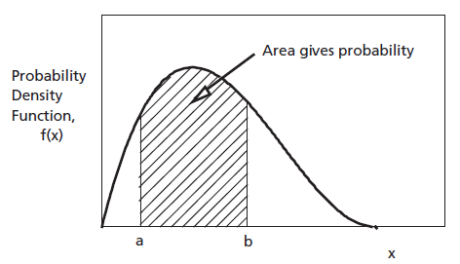

# Objective

Generate uniform samples in Matlab, visualize them with histograms, and study
how the interval changes their distribution. Compute theoretical probabilities
and compare them with estimates from samples.

# Theoretical aspects

## Probability density function

In this lab we consider **continuous random variables**.

A continuous random variable $A$ is described by a **probability density function** (PDF) $w_A(x)$,
which describes how probability is distributed over possible values. The probability of an interval is obtained by integrating the PDF, not by evaluating it at a single point.

The probability of $A$ being in the interval $[a,b]$ is the **area under the PDF** in that interval,
i.e. the integral of the PDF from $a$ to $b$:

  $$P(a<A\le b)=\int_a^b w_A(x)\,dx,$$

Only intervals have nonzero probability. The probability of $A$ being exactly equal to a certain value is always zero.

{width=50% fig-align="center"}

The PDF is always $w_A(x)\ge 0$ and its integral is 1, but its values can be greater than 1.

The **cumulative distribution function** (CDF) is defined as the probability that $A \le x$:

$$
F_A(x)=P(A\le x)
$$

The CDF is nondecreasing and takes values between 0 and 1.

The CDF can also be used to compute probabilities over intervals:

$$
P(a<A\le b)=F_A(b)-F_A(a).
$$

The two functions are related. The PDF is the derivative of the CDF:

$$
w_A(x)=\frac{dF_A(x)}{dx} \qquad \qquad F_A(x)=\int_{-\infty}^{x} w_A(t)\,dt.
$$

### Random samples

A vector of $N$ values generated from a distribution is a **random sample**:

$$x = [x_1, x_2, \ldots, x_N].$$

Values change at every run, but their statistical behavior should remain the
same.

The mean and the variance (or standard deviation) computed from a given vector of samples
are known as **sample mean** and **sample variance** (or standard deviation).

```matlab
% Sample mean, standard deviation and variance from data
sample_mean = mean(x)
sample_std = std(x)
sample_var = var(x)
```

The sample mean and sample variance are close to, but not exactly equal to, the theoretical mean and variance of the
distribution (they are "estimates" of these theoretical values).

## The uniform distribution

### Definition and parameters

The uniform distribution describes a random variable that has equal chances of taking any value in a given interval $[a,b]$.

It is denoted as:

$$A \sim \mathcal{U}[a,b], \qquad \textrm{  with  } a < b.$$

Its probability density function (PDF) is defined as:

$$
w_A(x) =
\begin{cases}
\dfrac{1}{b-a}, & a \le x \le b, \\
0, & \text{otherwise}.
\end{cases}
$$

The PDF is constant on $[a,b]$.

![PDF for $\mathcal{U}[-2,2]$.](figures/Lab2_uniform_pdf.png){width=72% fig-align="center"}

Its statistical mean and variance are

$$
\mathrm{E}\{A\} = \frac{a+b}{2},
\qquad
\sigma_A^2 = \frac{(b-a)^2}{12}.
$$

### Generating uniform samples in Matlab

`rand()` generates uniform values with $0<A<1$.
It does not matter if the endpoints $0$ and $1$ are included or not,
because there are infinitely many values in the interval, anyway.

```matlab
A = rand()          % one value from U[0,1]

A = rand(1, 10)     % row vector with 10 independent values from U[0,1]
```

To obtain values from a general interval $[a,b]$, scale and shift the values:

$$B = a + (b-a)A, \qquad A \sim \mathcal{U}[0,1].$$

```matlab
a = 5;
b = 7;
N = 1000;

x_uniform = a + (b-a)*rand(1, N);
```

Here, $b-a$ sets the width and $a$ sets the lower limit.


### Probabilities for the uniform distribution

Probabilities are areas under the PDF.

For a uniform variable, computing probabilities amounts to
computing some rectangle area, and can be computed easily.

Example: for $X \sim \mathcal{U}[2, 10]$, the probability that $X$ is between 3 and 5 is $\frac{2}{8} = 0.25$.


## Histograms as a visualization of distributions

A **histogram** groups sample values into intervals called **bins**.
The height of each bar is the number of samples in that bin:

```matlab
x = -4 + 14*rand(1, 10000);
histogram(x, 30)
xlabel('Value')
ylabel('Number of samples')
grid on
```

Use `figure` to open a new figure window before plotting another histogram.
The bin count controls the level of detail: many bins give more detail, but
fewer samples per bin and more irregular bar heights.

For comparison with a PDF, use `'Normalization','pdf'`:

```matlab
figure
histogram(x, 30, 'Normalization', 'pdf')
xlabel('Value')
ylabel('Estimated probability density')
grid on
```

Each bar height is the bin count divided by the total sample count and the bin
width. The **total bar area**, not the sum of the heights, is 1.
For a large uniform sample, the bar heights should be close to $1/(b-a)$.

## Estimating probabilities from samples

Estimate a probability by counting the samples that satisfy a condition and
dividing by the total number of samples:

```matlab
p_estimated = sum(x >= -1 & x <= 3)/numel(x);
```

The comparisons produce logical vectors; `&` combines the two conditions.
`sum()` counts the true entries, and `numel()` gives the number of samples.
Different generated samples give different estimates. Larger samples generally
give more accurate estimates, but an improvement is not guaranteed at every run.

## Summary: functions and notation you should know

<style>
table td, table th { border-bottom: 1px solid #ddd; }
</style>

| Signature or notation | Example | Description |
|---|---|---|
| $w_A(x)$ | $P(c<A\le d)=\int_c^d w_A(x)\,dx$ | Probability density; interval probability is an area |
| $F_A(x)$ | $F_A(x)=P(A\le x)$ | Cumulative distribution function |
| $A\sim\mathcal{U}[a,b]$ | $A\sim\mathcal{U}[-4,10]$ | Uniform distribution on $[a,b]$ |
| `rand(m,n)` | `rand(1,1000)` | $m\times n$ uniform samples on $[0,1]$ |
| `a + (b-a)*rand(m,n)` | `-4 + 14*rand(1,1000)` | Uniform samples on $[a,b]$ |
| `mean(x)`, `std(x)`, `var(x)` | `mean(x)` | Sample mean, standard deviation and variance |
| `histogram(x,n)` | `histogram(x,30)` | Histogram with `n` bins; add `'Normalization','pdf'` for unit area |
| `figure` | `figure` | Open a new figure window |
| `sum(condition)/numel(x)` | `sum(x > 7)/numel(x)` | Empirical probability |

```{=latex}
\newpage
```

# Theoretical exercises

1. Let $A$ be a continuous random variable with the uniform distribution $\mathcal{U}[0, \; 6]$

   a. Draw the probability density function of $A$.
   b. Calculate the probability $P(A > 2.7)$.
   c. Calculate the probability $P(A \in (0, \; 2.3))$.
   d. Draw the cumulative distribution function $F_A(x)$ and write its mathematical expression.
   e. What is the distribution of the random variable $B$ defined as $B = A - 2$?
   f. What is the distribution of the random variable $C$ defined as $C = 3*A$?


# Exercises

Write all commands yourself in a script or live script. Label figures and answer
interpretation questions in comments.

1. Uniform random samples:

   a. Generate $N=10000$ samples from $\mathcal{U}[-4,10]$ and store them in `x_uniform`.
   b. Display the minimum and maximum. Do they equal the interval endpoints?
   c. Compute the sample mean and compare it with $(a+b)/2$.
   d. Plot the first 100 values. Use sample index on the horizontal axis.

2. Histograms:

   a. Plot a histogram of `x_uniform` with 30 bins.
   b. In a new figure, plot a 30-bin PDF-normalized histogram. Compare the
      bar heights with the theoretical density $1/(b-a)$.
   c. Repeat with 10 and 100 bins. What changes? Which histogram is more irregular?
   d. Generate a new vector with $N=100$ and repeat the 30-bin PDF-normalized
      histogram. Compare it with the one for $N=10000$.

3. The effect of the interval:

   a. Generate 10000 samples each from $\mathcal{U}[0,1]$, $\mathcal{U}[5,6]$,
      and $\mathcal{U}[5,7]$.
   b. Plot PDF-normalized histograms with 30 bins in separate figures.
   c. Compare location, width, and height. Which pair differs only by a shift?
   d. Compute each sample mean and compare it with its theoretical value.

4. Probabilities for a uniform variable:

   Let $A\sim\mathcal{U}[-4,10]$.

   a. Compute theoretically $P(-1\le A\le 3)$ and $P(A>7)$.
   b. Estimate both probabilities from `x_uniform` using logical comparisons and `sum()`.
   c. Repeat with $N=100$, $1000$, and $100000$. Compare estimates with theory.
   d. Repeat the experiment. Does the largest sample always give the closest estimate?

## Supplementary exercise

5. Write `p = myCDF(v, x)` to estimate $P(V\le x)$ as the fraction of values
   in `v` that are less than or equal to `x`.

   a. For $A\sim\mathcal{U}[-4,10]$, write the theoretical CDF inside and outside the interval.
   b. Generate 10000 samples. Evaluate `myCDF` at 100 points from $-6$ to $12$
      using a `for` loop.
   c. Plot the estimated and theoretical CDFs together.

# Final questions

1. A uniform PDF on a short interval can be greater than 1. Why does this not
   imply a probability greater than 1?
2. Can an empty histogram bin prove that the underlying probability of that
   interval is zero?
3. If you double the sample count but keep the same bin edges, what should
   happen to a count histogram? To a PDF-normalized histogram?
4. Can two histograms of the same vector look substantially different?
   What would you check before concluding that their distributions differ?
