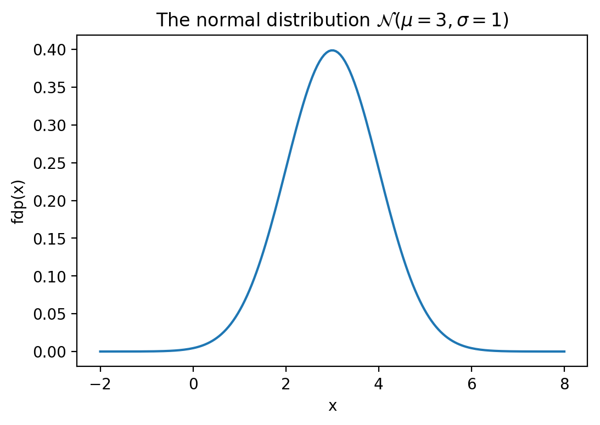
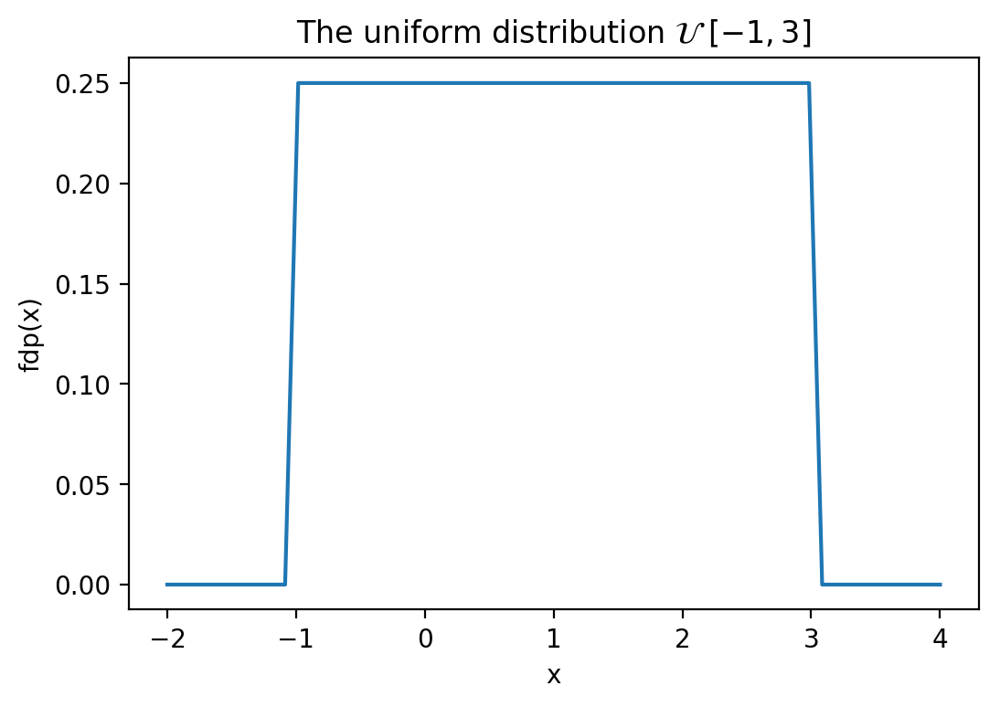
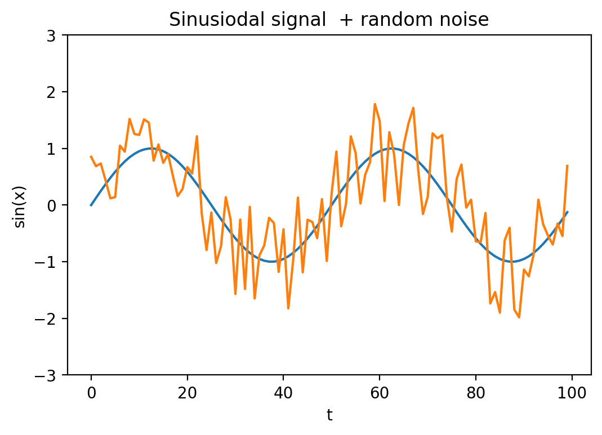
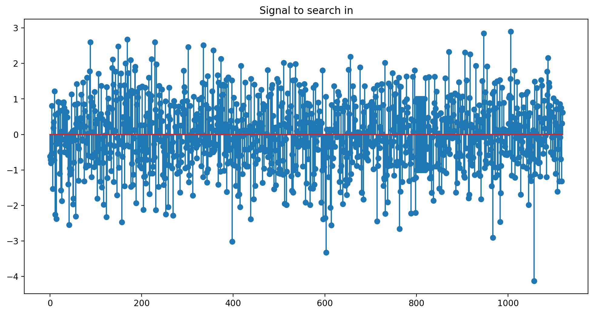
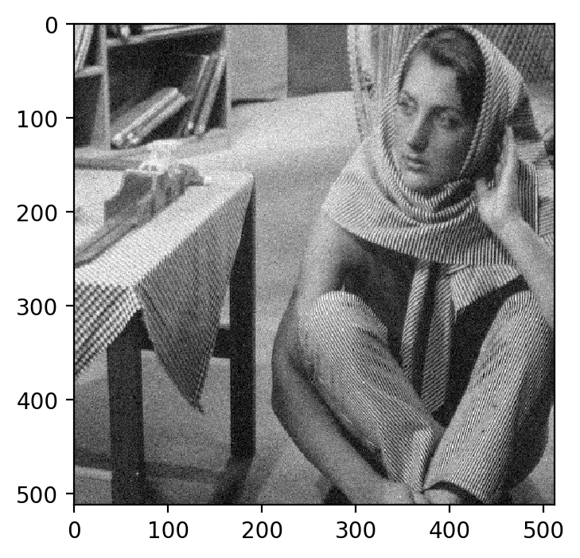
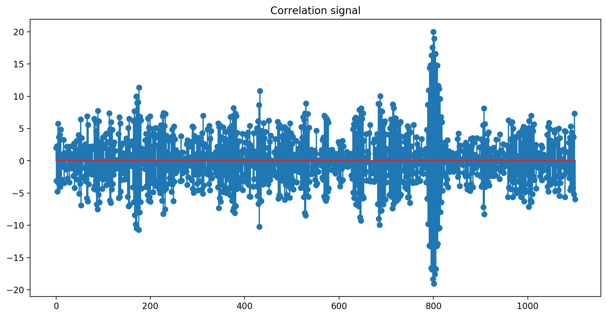
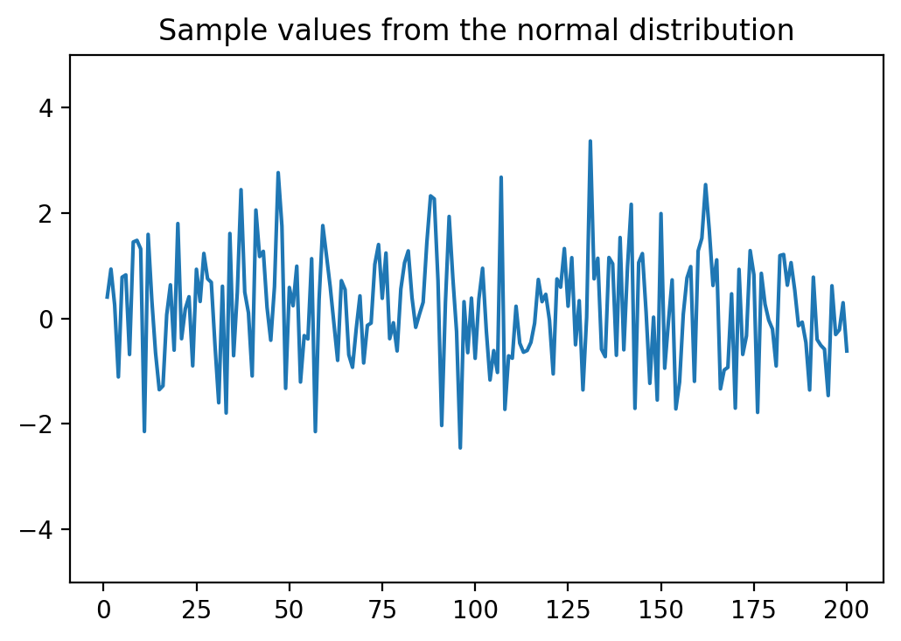
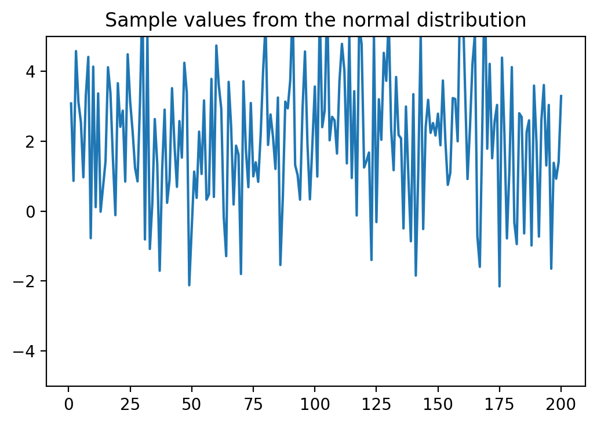
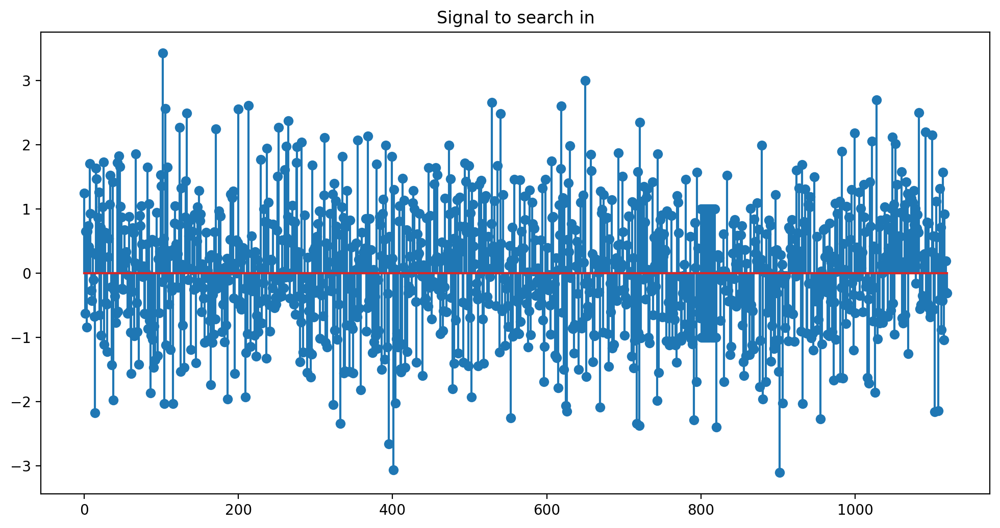
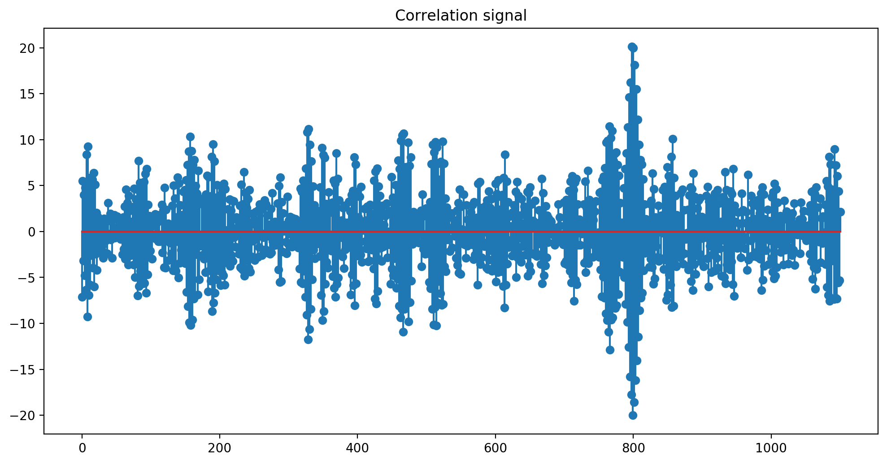

# Chapter I. Random Signals

## I.1 Random variables

### Random variables

* A **random variable** is a variable that holds a value produced
by a (partially) random phenomenon
    * basically it is *a name* attached to an arbitrary value
    * short notation: r.v.
* Typically denoted as $X$, $Y$ etc..

* Examples:
    * $X$ = The value of a dice
    * $V_{in}$ = The value of the voltage in one point of a circuit

### Off-topic: Glossary

- *"i.e."* = *id est* = "that is" = "adică"

- *"e.g."* = *exampli gratia* = "for example" = "de exemplu"

### Realizations

* **A realization** of a random variable = one possible value it can take
    * e.g. the value 3 of a dice
    * at different times, one may get different realizations

* **Sample space** $\Omega$ = the set of all values that can be taken by a random variable $X$
    * i.e. the set of all possible realizations

* Example: rolling a dice
    * The r.v. is denoted as $X$
    * We might get a realization $X = 6$
    * But we could have got any value from the sample space
    $$\Omega = \left\{1, 2, 3, 4, 5, 6\right\}$$

### Rolling a die

- Random variable X = "the face obtained by throwing a coin"
	
	\smallskip

    {.id width=50%}

(image from *https://www.mathsisfun.com/data/random-variables.html*)


### Discrete and continuous random variables

* **Discrete** random variable: if $\Omega$ is a discrete set
    * Example: value of a dice
* **Continuous** random variable: if $\Omega$ is a continuous set
    * Example: a voltage value

### Why random variables?

- Random variables are a great model for **noise**

- Examples:
    - Measure a voltage in a circuit
    - Measure several times, the value is never precisely the same.
The values always *varies* a little.
    - i.e. it is affected by noise

### Probability Mass Function

- Consider a **discrete** r.v. $A$

- The **probability mass function (PMF)** = the probability that $A$ has value $x$
$$w_A(x)= P\left\{ A = x\right\}$$

- Also known as the **distribution** of $A$

- Example: what is the PMF of a dice? Plot on board.

### Computing probability based on PMF

- Probability that $A$ is equal to some value $v$
$$P\left\{ A = v\right\} = w_A(v)$$

- Probability that $A$ is between $a$ and $b$ (including):
$$P\left\{ a \leq A \leq b\right\} = \sum_{x=a}^b w_A(x)$$

### Cumulative Distribution Function

- The **cumulative distribution function (CDF)** = the probability
that the value of $A$ is smaller or equal than $x$
$$F_A(x) = P\left\{ A \leq x \right\}$$

- In Romanian: *"funcție de repartitie"*

- Example: what is the CDF of a dice? Plot on board.

- For discrete r.v., the CDF is "stairwise"

### Computing probability based on CDF

- Probability that $A$ is equal to some value $v$
$$P\left\{ A = v\right\} = F_A(v) - F_A(v-1)$$

- Probability that $A$ is between $a$ and $b$ (including):
$$P\left\{ a \leq A \leq b\right\} = F_A(b) - F_A(a-1)$$

### Relation between PMF and CDF

- CDF is the *cumulative sum* (i.e. the integral) of PMF
$$F_A(x) = \sum_{t = -\infty}^{t = x} w_A(t)$$

- Example for dice: easy to notice graphically

### Probability Density Function

- Consider a **continuous** r.v. $A$ 
    - assume it takes values in some interval $[a, b]$
    
- The **Probability Density Function (PDF)** of $A$
= probability that the value of $A$ is in a small vicinity $epsilon$ around $x$, divided by $epsilon$

- Denoted as $w_A(x)$, also known as **the distribution** of A

- Informally, the PDF gives the probability that the value of $A$ is **close to** $x$

### Continuous and discrete random variables

\smallskip

{.id width=80%}

(image from "Probability Distributions: Discrete and Continuous", Seema Singh, *https://towardsdatascience.com/probability-distributions-discrete-and-continuous-7a94ede66dc0*)

### Probability of an exact value

- The probability that a continuous r.v. $A$ is **exactly** equal to a value $x$ is **zero**
    - because there are an infinity of possibilities (continuous)
    - That's why we can't define a probability mass function like for discrete r.v.

- That's why the PDF says **in a small vicinity** around some value $x$, and not precisely equal to $x$

### Computing probability based on PDF

- Probability that $A$ is equal to some value $v$ is always 0
$$P\left\{ A = v\right\} = 0$$

- Probability that $A$ is between $a$ and $b$ = integral of PDF from $a$ to $b$:
$$P\left\{ a \leq A \leq b\right\} = \int_a^b w_A(x) dx$$

### Cumulative Distribution Function

- The **cumulative distribution function (CDF)** = the probability
that the value of $A$ is smaller or equal than $x$
$$F_A(x) = P\left\{ A \leq x \right\}$$

- In Romanian: *"funcție de repartiție"*

- Same definition as for discrete r.v.

### Computing probability based on CDF

- Probability that $A$ is between $a$ and $b$:
$$P\left\{ a \leq A \leq b\right\} = F_A(b) - F_A(a)$$

- Doesn't matter if we consider closed or open interval 
    - $[a,b]$ or $(a,b)$
    - why? 

### Relation between PDF and CDF

- CDF is **the integral** of PMF
- PDF is **the derivative** of CDF

$$F_A(x) = \int_{-\infty}^x w_A(x) \mathrm{d}x$$

$$\begin{split}
w_A(x) &= \frac{\mathrm{d}F_A(x)}{\mathrm{d}x} \\
&= \lim_{\epsilon \to 0}{\frac{F_A(x+\epsilon) - F_A(x-\epsilon)}{2 \epsilon}} \\
&= \lim_{\epsilon \to 0}{\frac{P(A \in [x-\epsilon, x+\epsilon])}{2 \epsilon}}
\end{split}$$
    
### Graphical interpretation 

* Probability that a continuous r.v. $A$ is between $a$ and $b$ is **the area below the PDF**
    * i.e. the integral from $a$ to $b$
    
* Probability that $A$ is exactly equal to a certain value is zero
    * the area below a single point is zero

\smallskip

{.id width=50%}

(image from "https://intellipaat.com/blog/tutorial/statistics-and-probability-tutorial/probability-distributions-of-continuous-variables/*)


### Discrete vs continuous r.v.

Comparison of discrete vs continous random variables:

- The CDF $F_A(x)$ is defined identically, means same thing
- The PDF/PMF $w_A(x)$ is the derivative of CDF
    - for continuous r.v.:
        - it is a proper derivative
        - it means probability to be "around" $x$
    - for discrete r.v:
        - sort of "discrete derivative"
        - it means probability to be exactly equal to $x$

### Properties of random variables

CDF:

- The CDF is always $\geq 0$
- The CDF is always monotonously increasing (non-decreasing)
- The CDF starts from 0 and goes up to 1
$$F_A(-\infty) = 0 \;\;\;\; F_A(\infty) = 1$$

PDF/PFM:

- The PDF/PMF are always $\geq 0$
- Integral/sum over all of the PDF/PMF = 1
$$\int_{-\infty}^\infty w_A(x) \mathrm{d}x = 1$$
$$\sum_{x = -\infty}^\infty w_A(x) = 1$$

### Different distributions

* Normal sine signal


{width=8cm}\


### Different distributions

* Sine + noise 1 (normal, $\mu = 0, \sigma^2 = 1$)


{width=8cm}\


### Different distributions

* Sine + noise 2 (uniform $\mathcal{U} [-1,1]$)

* What's different? The distribution type


{width=8cm}\


### Different distributions

* Clean Image 


{width=8cm}\


### Different distributions

* Image + noise (normal, $\mu = 0, \sigma^2 = 1$)


{width=8cm}\


### Different distributions

* Image + larger noise (normal, $\mu = 0, \sigma^2 = 10$)


{width=8cm}\


### Different distributions

* Image + noise (uniform, $\mathcal{U} [-5, 5]$)


{width=8cm}\


### The normal distribution

* Probability density function

$$w_A(x) = \frac{1}{\sigma \sqrt{2 \pi}} e^{-\frac{(x-\mu)^2}{2 \sigma^2}}$$


{width=8cm}\


### The normal distribution

- Has two parameters:
    - **Average value** $\mu$ = "center" of the function
    - **Standard deviation** $\sigma$  = "width" of the function
        - Small $\sigma$ = narrow and tall
        - Big $\sigma$ = wide and low

- The front constant is just for normalization (ensures that integral = 1)
    
- Extremely often encountered in real life

- Any real value is possible ($w_A(x) > 0, \forall x \in \mathbb{R}$)

- Usually denoted as $\mathcal{N}(\mu, \sigma^2)$

### The normal distribution 

- The distribution decreases as $x$ gets farther from $\mu$
    - Because of the term $-(x - \mu)^2$ at the exponent
    - Most likely values: around $\mu$ ($x - \mu = 0$)
    - Values closer to $\mu$ are more likely, values farther from $\mu$ are less likely

- The function describes a preference for values around $\mu$, 
with decreasing preference when getting farther from $\mu$

### Example of values from the normal distribution (mu=0, sigma=1)


{width=8cm}\


### Example of values from the normal distribution (mu=2, sigma=4)


{width=8cm}\


### The uniform distribution

* The probability density function = a constant, between two endpoints

$$w_A(x) = 
\begin{cases}
\frac{1}{b-a}, & x \in [a, b] \\
 0, &elsewhere
\end{cases}$$


{width=8cm}\


### The uniform distribution

- Has two parameters: the limits $a$ and $b$ of the interval

- The "height" of the function is $\frac{1}{b-a}$
    - in order for the integral to be 1
    
- Only values from the interval $[a, b]$ are possible
    - value cannot be outside interval (probability is 0)

- Denoted as $\mathcal{U} \;[a, b]$

### Other distributions

* Many other distributions exist, relevant for particular applications

### Computing probabilities for the normal distribution

- How to compute $\int_a^b$ for a normal distribution?
    - Can't be done with algebraic formula, non-elementary function

- Use *the error function*:
$$erf(z) = \frac{2}{\sqrt{\pi}} \int_0^z e^{-t^2} dt$$

- The CDF of a normal distribution $\mathcal{N}(\mu, \sigma^2)$
$$F_A(X) = \frac{1}{2}(1 + erf(\frac{x - \mu}{\sigma \sqrt{2}}))$$

- The values of *erf()* are available / are computed numerically
    - e.g. on Google, search for $erf(0.5)$
    - Other useful values:
        - $erf(-\infty) = -1$
        - $erf(\infty) = 1$

### Exercise

Exercise:

  - Let $X$ be a r.v. with distribution $\mathcal{N}(3, 2)$. 
Compute the probability that $X \in [2, 4]$

### Sum of constant + random variable

- Consider a random variable $A$
- What is $B = 5 + A$?

Answer:

- B is also a random variable
- B has same type of distribution, but the function is "shifted" by 5 to the right

Example:

- A is normal variable with $w_A(x) = \mathcal{N}(\mu=3, \sigma^2=2)$
- What is the distribution of B = 5 + A?
- Answer: $w_B(x) = \mathcal{N}(\mu=8, \sigma^2=2)$

### R.v. as functions of other r.v.

- A function applied to a r.v. produces another r.v.

- Examples: if $B$ is a r.v. with distribution $\mathcal{U}\;[0,10]$, then
    - $C = 5 + A$ is another r.v., with distribution $\mathcal{U}\;[5,15]$
    - $D = A^2$ is also another r.v.
    - $E = cos(A)$ is also another r.v.
    
- Reason: since $A$ is random, the values $B$, $C$, $D$ are also random

- A, B, C, D are *not independent*
    - A certain value of one of them automatically implies the value of the others

### Multiple random variables

- Consider a system with two continuous r.v. $A$ and $B$

- What is the probability that the pair $(A,B)$ has values
around $(x, y)$? 

- Distribution of the values of $(A,B)$ is described by:
    - joint probability density function $w_{AB}(x,y)$
    - joint cumulative density function $F_{AB}(x,y)$

### Multiple random variables

- Joint cumulative distribution function:
$$F_{AB}(x, y) = P\left\{ A \leq x \cap B \leq y \right\}$$

- Joint probability density function:
$$w_{AB}(x,y) = \frac{\partial^2 P_{AB}(x,y)}{\partial x \partial y}$$

- The joint PDF gives the probability that the value of the pair $(A,B)$
is in a vicinity of $(x,y)$

- Similar for discrete random variables
$$w_{AB}(x,y) = P\left\{ A = x \cap B = y \right\}$$

### Independent random variables

- Two v.a. $A$ and $B$ are **independent** if the value of one of them
does not influence in any way the value of the other

- For independent r.v., the probability that $A$ is around $x$
 and $B$ is around $y$ is **the product** of the two probabilities

$$w_{AB}(x,y) = w_A(x) \cdot w_B(y)$$

- Relation holds for CDF / PDF / PMF, continuous or discrete r.v.

- Same for more than two r.v.

### Independent random variables

Exercise: 

  - Compute the probability that three r.v. $X$, $Y$ and $Z$ i.i.d. $\mathcal{N}(-1,1)$
  are all positive simultaneously
      * ***i.i.d*** = "independent and identically distributed"

### Multiple normal variables

- Consider a set of $N$ normal r.v. $(A_1, ...A_N)$, with different $\mu_i$,
but same $\sigma$

- Then probability that $(A_1,...A_N)$ is around $(x_1, ...x_N)$ is
$$w_{A_1,...A_N}(x_1,...x_N) = \frac{1}{(\sigma\sqrt{2\pi})^N} e^{\frac{(x_1-\mu_1)^2+...+(x_N - \mu_N)^2}{2\sigma^2}}$$

- The probability depends on the **Euclidean distance** between
$\mathbf{x}=(x_1,...x_N)$ and $\mathbf{\mu} = (\mu_1,...\mu_N)$

### Euclidean distance 

- **Euclidean (geometric) distance** between two N-dimensional vectors:
$$d(\mathbf{u},\mathbf{v}) = \| \mathbf{u}-\mathbf{v} \| = \sqrt{(u_1-v_1)^2+...+(u_N - v_N)^2}$$

- One-dimensional: $\|\mathbf{u}-\mathbf{v}\| = |u-v|$

- 2D: $\|\mathbf{u}-\mathbf{v}\| = \sqrt{(u_1 - v_1)^2 + (u_2 - v_2)^2}$
       
- 3D: $\|\mathbf{u}-\mathbf{v}\| = \sqrt{(u_1 - v_1)^2 + (u_2 - v_2)^2 + (u_3 - v_3)^2}$

- ...

- N-dimensional: $\|\mathbf{u}-\mathbf{v}\| = \sqrt{\sum_{i=1}^N(u_i - v_i)^2}$

- ...

- Continuous signals: $\|\mathbf{u}-\mathbf{v}\| = \sqrt{\int_{-\infty}^{\infty}(u(t) - v(t))^2 dt}$

### Multiple normal variables

- Probability of $N$ normal random variables, independent, with same $\sigma$ but
possibly different $\mu_i$
depends on the **squared Euclidean distance to the mean vector** $\mathbf{\mu} = (\mu_1,...\mu_N)$
    - Close to $\mu$: higher probability
    - Far from $\mu$: lower probability
    - Two points at same distance from $\mu$ have same probability

### 2D normal distribution

- Distribution of 2 normal random variables (2D normal distribution)


### 2D normal distribution  - top view

- View from top
- Here, $\mu = (0,0)$
- Probability density decreases as distance from center increases,
in circles (symmetrically)

{.id width=50%}


### Statistical averages

* R.v. are described by statistical averages ("*moments*")

* **The average value** (moment of order 1)

* Continuous r.v.:
$$\overline{A} = E\{A\} = \int_{-\infty}^{\infty} x \cdot w_A(x) dx$$

* Discrete r.v.:
$$\overline{A} = E\{A\} = \sum_{x=-\infty}^{\infty} x \cdot w_A(x)$$

* (Example: the entropy of H(X) = the average value of the information)

* Usual notation: $\mu$

### Properties of the average value

* Computing the average value is a **linear** operation
    * because the underlying integral / sum is a linear operation

* Linearity
$$E\{c_1A + c_2B\} = c_1E\{A\} + c_2E\{B\}$$

* Or:
$$E\{cA\} = c E\{A\}, \forall c \in \mathbb{R}$$
$$E\{A + B\} = E\{A\} + E\{B\}$$

* No proof given here

### Average squared value

* **Average squared value** = average value of the squared values

* Moment of order 2

* Continuous r.v.:
$$\overline{A^2} = E\{A^2\} = \int_{-\infty}^{\infty} x^2 \cdot w_A(x) dx$$

* Discrete r.v.:
$$\overline{A^2} = E\{A^2\} = \sum_{-\infty}^{\infty} x^2 \cdot w_A(x)$$

* Interpretation: average of squared values = average power of a signal

### Variance

* **Variance**= average squared value of the difference to the average value

* Continuous r.v.:
$$\sigma^2 = \overline{\left\{ A - \mu \right\}^2} = \int_{-\infty}^{\infty} (x-\mu)^2 \cdot w_A(x) dx$$

* Discrete r.v.:
$$\sigma^2 = \overline{\left\{ A - \mu \right\}^2} = \sum_{-\infty}^{\infty} (x-\mu)^2 \cdot w_A(x)$$

* Interpretation: how much do the values vary around the average value
    * $\sigma^2 =$ large: large spread around the average value
    * $\sigma^2 =$ small: values are concentrated around the average value

### Relation between the three values

* Relation between the average value, the average squared value, and the variance:
$$\begin{split}
\sigma^2 &= \overline{\left\{ A - \mu \right\}^2} \\
&= \overline{A^2 - 2 \cdot A \cdot \mu + \mu^2} \\
&= \overline{A^2} - 2 \mu \overline{A} + \mu^2 \\
&= \overline{A^2} - \mu^2
\end{split}$$

### Sum of random variables

* Sum of two or more **independent** r.v. is also a r.v.

* Its distribution = the **convolution** of the distributions of the two r.v.

* If $C = A + B$
$$w_C(x) = w_A(x) \star w_B(x)$$

* Particular case: if $A$ and $B$ are normal r.v., with $\mathcal{N}(\mu_A, \sigma_A^2)$ and $\mathcal{N}(\mu_B, \sigma_B^2)$, then:
    * $C$ is also a normal r.v., with $\mathcal{N}(\mu_C, \sigma_C^2)$, having:
    * average = sum of the two averages: $\mu_C = \mu_A + \mu_B$
    * variance = sum of the two variances: $\sigma_C^2 = \sigma_A^2 + \sigma_B^2$
    

## I.2 Random processes

### Random process

* A **random process** = a sequence of random variables indexed in time

* **Discrete-time** random process $f[n]$ =  a sequence of random variables at discrete moments of time
    * e.g.: a sequence 50 of throws of a dice, the daily price on the stock market

* **Continuous-time** random process $f(t)$ = a continuous sequence of random variables at every moment
    * e.g.: a noise voltage signal, a speech signal

* Every sample from a random process is a (different) random variable!
    * e.g. $f(t_0)$  = value at time $t_0$ is a r.v.

### Realizations of random processes

* A **realization** of the random process = a particular sequence of realizations of the underlying r.v.
    * e.g. we see a given noise signal on the oscilloscope, but *we could have
    seen any other realization just as well*

* When we consider a random process = we consider the set of all possible realizations

### Distributions of order 1 of random processes

* Every sample $f(t_1)$ from a random process is a random variable
    * it is described by a **distribution of order 1**
    * has a CDF $F_1(x;t_1)$
    * has a PDF $w_1(x;t_1) = \frac{dF_1(x;t_1)}{dx}$
    * everything depends on the time moment $t_1$

* The sample at time $t_2$ is a different random variable with **possibly different** functions
    * has a different CDF $F_1(x;t_2)$
    * has a different PDF $w_1(x;t_2) = \frac{dF_1(x;t_2)}{dx}$

* These functions specify how the value of one sample is distributed

* The index $w_1$ indicates we consider a single random variable (distribution of order 1)

* Same for discrete-time random processes

### Distributions of order 2

* A pair of random variables $f(t_1)$ and $f(t_2)$ form a system of 2 r.v.
    * they are described by a **distribution of order 2**
    * have a joint CDF $F_2(x_i, x_j; t_1, t_2)$
    * have a joint PDF $w_2(x_i, x_j; t_1, t_2) = \frac{\partial^2 F_2(x_i, x_j;t_1, t_2)}{\partial x_i \partial x_j}$
    * depend on time moments $t_1$ and $t_2$

* These functions specify how the pair of values is distributed

* Same for discrete-time random processes

### Distributions of order n

* Generalize to $n$ samples of the random process

* A set of $n$ random variables $f(t_1), ...f(t_n)$ from the random process $f(t)$
    * are described by **distribution of order n**
    * have joint CDF $F_n(x_1,... x_n; t_1,... t_n)$
    * have joint PDF $w_n(x_1,... x_n; t_1,... t_n) = \frac{\partial^2 F_n(x_1,... x_n;t_1,... t_n)}{\partial x_1 ... \partial x_n}$
    * depend on time moments $t_1$, $t_2$, ... $t_n$
* These functions specify how the whole set of $n$ values is distributed

* Same for discrete-time random processes

### Statistical averages

Random processes are characterized using statistical and temporal averages (*moments*)

For continuous random processes:

1. Average value
$$\overline{f(t_1)} = \mu(t_1) = \int_{-\infty}^{\infty} x \cdot w_1(x; t_1) dx$$

2. Average squared value (*valoarea patratica medie*)
$$\overline{f^2(t_1)} = \int_{-\infty}^{\infty} x^2 \cdot w_1(x; t_1) dx$$


### Statistical averages - variance
3. Variance (= *varianța*)
$$\sigma^2(t_1) = \overline{\left\{ f(t_1) - \mu(t_1) \right\}^2} = \int_{-\infty}^{\infty} (x-\mu(t_1)^2 \cdot w_1(x; t_1) dx$$

* The variance can be computed as:
$$\begin{split}
\sigma^2(t_1) =& \overline{\left\{ f(t_1) - \mu(t_1) \right\}^2} \\
=& \overline{f(t_1)^2 - 2f(t_1)\mu(t_1) + \mu(t_1)^2} \\
=& \overline{f^2(t_1)} - \mu(t_1)^2
\end{split}$$

* Note:
    * these three values are calculated across all realizations, at time $t_1$
    * they characterize only the sample at time $t_1$
    * at a different time $t_2$, the r.v. $f(t_2)$ is different so all average values might be different

### Statistical averages - autocorrelation

4. The autocorrelation function
$$R_{ff}(t_1,t_2) = \overline{f(t_1) f(t_2)} = \int_{-\infty}^\infty \int_{-\infty}^\infty x_1 x_2 w_2(x_1, x_2; t_1, t_2) dx_1 dx_2$$

5. The correlation function (for different random processes $f(t)$ and $g(t)$)
$$R_{fg}(t_1,t_2) = \overline{f(t_1) g(t_2)} = \int_{-\infty}^\infty \int_{-\infty}^\infty x_1 y_2 w_2(x_1, y_2; t_1, t_2) dx_1 dy_2$$

* Note:
    * these functions may have different values for a different pair of values ($t_1$,$t_2$)

### Discrete random processes

For **discrete random processes**, nothing changes (except notation from $f(t)$ to $f[t]$):


### Temporal averages

* What to do when we only have access to a single realization $f^{(k)}(t)$?
* Compute values **for a single realization $f^{(k)}(t)$, across all time moments**
* For continuous random processes:

1. Temporal average value
$$\overline{f^{(k)}(t)} = \mu^{(k)} = \lim_{T \to \infty} \frac{1}{2T} \int_{-T}^{T} f^{(k)}(t) dt$$

2. Temporal average squared value
$$\overline{[f^{(k)}(t)]^2} = \lim_{T \to \infty} \frac{1}{2T} \int_{-T}^{T} [f^{(k)}(t)]^2 dt$$

### Temporal variance
3. Temporal variance
$$\sigma^2 = \overline{\left\{ f^{(k)}(t) - \mu^{(k)} \right\}^2} = \lim_{T \to \infty} \frac{1}{2T} \int_{-T}^{T} (f^{(k)}(t)-\mu^{(k)})^2 dt$$

* The variance can be computed as:
$$\sigma^2 = \overline{[f^{(k)}(t)]^2} - [\mu^{(k)}]^2$$

* Note:
    * these values do not depend anymore on time $t$ (integrated)

### Temporal autocorrelation

4. The temporal autocorrelation function
$$\begin{split}
R_{ff}(t_1,t_2) =& \overline{f^{(k)}(t_1 + t) f^{(k)}(t_2+t)} \\
=& \lim_{T \to \infty} \frac{1}{2T} \int_{-T}^{T} f^{(k)}(t_1+t) f^{(k)}(t_2 + t) dt
\end{split}$$

5. The temporal correlation function (for different random processes $f(t)$ and $g(t)$)
$$\begin{split}
R_{fg}(t_1,t_2) =& \overline{f^{(k)}(t_1 + t) g^{(k)}(t_2+t)}\\
=& \lim_{T \to \infty} \frac{1}{2T} \int_{-T}^{T} f^{(k)}(t_1+t) g^{(k)}(t_2 + t) dt
\end{split}$$

### Discrete random processes

For **discrete random processes**, replace $\int$ with $\sum$, $T$ with $N$,
and divide to $2N+1$ instead of $2T$

1. $\overline{f^{(k)}[t]} = \mu^{(k)} = \lim_{N \to \infty} \frac{1}{2N+1} \sum_{t=-N}^{N} f^{(k)}[t]$

2. $\overline{[f^{(k)}[t]]^2} = \lim_{N \to \infty} \frac{1}{2N+1} \sum_{t=-N}^{N} (f^{(k)}[t])^2$

3. $\sigma^2 = \overline{\left\{ f^{(k)}[t] - \mu^{[k]} \right\}^2} = \lim_{N \to \infty} \frac{1}{2N+1} \sum_{t=-N}^{N} (f^{(k)}[t]-\mu^{(k)})^2$

### Discrete random processes

4. Temporal autocorrelation:
$$\begin{split}
R_{ff}(t_1,t_2) =& \overline{f^{(k)}[t_1 + t] f^{(k)}[t_2+t]} \\
=& \lim_{N \to \infty} \frac{1}{2N+1} \sum_{t=-N}^{N} f^{(k)}[t_1+t] f^{(k)}[t_2 + t]
\end{split}$$

5. Temporal correlation:
$$\begin{split}
R_{fg}(t_1,t_2) =& \overline{f^{(k)}[t_1 + t] g^{(k)}[t_2+t]}\\
=& \lim_{N \to \infty} \frac{1}{2N+1} \sum_{t=-N}^{N} f^{(k)}[t_1+t] g^{(k)}[t_2 + t]
\end{split}$$


### Finite length realizations

If the realization is not from time $-\infty$ to $\infty$, but only from a $t_{min}$ to $t_{max}$,
just use $\int_{t_{min}}^{t_{max}}$ or $\sum_{t_{min}}^{t_{max}}$ for the temporal averages

* Example: Compute the temporal averages for the finite-length realization 
$$\{1,-1,2,-2,3,-3,4,-4,5,-5\}$$

### Statistical and temporal averages

* Statistical averages are usually the relevant values
    - but they require to know the distributions 
* In real life, with unknown signals, we can only measure one realization
    - so we can only compute the temporal values for one realization
* Fortunately, in many cases they are the same (ergodicity, see later)

### Stationary random processes

* All the statistical averages are dependent on the time
    * i.e. they might be different for a sample at $t_2$

* **Stationary** random process = when all statistical averages
are **identical if we shift the time origin** (e.g. delay the signal)

* Equivalent definition: if all the PDF are identical when shifting the time origin
$$w_n(x_1,...x_n; t_1,...t_n) = w_n(x_1,...x_n; t_1+\tau,... t_n + \tau)$$

* Basically, nothing should depend on the time $t$

### Strict-sense and wide-sense stationary

* Strictly stationary / strongly stationary / strict-sense stationary:
    * relation holds for every $n$

* Weakly stationary / wide-sense stationary:
    * relation holds only for $n=1$ and $n=2$  (the most used)

### Consequences of stationarity

* For $n=1$:
$$w_1(x_i;t_1) = w_1(x_i; t_2) = w_1(x_i)$$

* The average value, average squared value, variance 
of a sample are all **identical** for any time $t$
$$\overline{f(t)} = constant, \forall t$$
$$\overline{f^2(t)} = constant, \forall t$$
$$\sigma^2(t) = constant, \forall t$$

### Consequences of stationarity

* For $n=2$:
$$w_2(x_i,x_j;t_1,t_2) = w_2(x_i,x_j;0, t_2-t_1) = w_2(x_i,x_j; t_2-t_1)$$

* The autocorrelation function depends only on the 
**time difference** $\tau = t_2 - t_1$ between the samples
$$R_{ff}(t_1,t_2) = R_{ff}(0, t_2 - t_1) = R_{ff}(\tau) = \overline{f(t) f(t + \tau)}$$

* Depends on a single value $\tau$ = time difference of the two samples

### Consequences of stationarity

* Definition of autocorrelation function for **stationary** r.p:
    * the function now depends on $\tau = t_2 - t_1$, instead of $t_1$ and $t_2$

* Statistical autocorrelation: no change

* Temporal autocorrelation:
    * for continuous r.p.
    $$\begin{split}
    R_{ff}(\tau) =& \overline{f(t) f(t + \tau)} \\
    =& \lim_{T \to \infty} \frac{1}{T} \int_{-T/2}^{T/2} f^{(k)}(t) f^{(k)}(t + \tau) dt
    \end{split}$$

    * for discrete r.p.
    $$\begin{split}
    R_{ff}(\tau) =& \overline{f(t) f(t + \tau)} \\
    =& \lim_{N \to \infty} \frac{1}{2N+1} \sum_{t=-N}^{N} f^{(k)}[t] f^{(k)}[t + \tau]
    \end{split}$$
    
    * finite length: limit the integrals / sums to the length of the signal, $\int_{t_{min}}^{t_{max}}$ or $\sum_{t_{min}}^{t_{max}}$


### Consequences of stationarity

* Same for correlation function between two different r.p

* Depends only on the **time difference** $\tau = t_2 - t_1$ between the samples
$$R_{fg}(t_1,t_2) = R_{fg}(0, t_2 - t_1) = R_{fg}(\tau) = \overline{f(t) g(t + \tau)}$$

* Definition is similar to the autocorrelation definition on the previous slide


### Interpretation of autocorrelation

- $R_{ff}(\tau)$ = the average value of the product of two samples which are time $\tau$ apart
    - e.g. tells us if the two samples vary in same direction or not

- Same for correlation, but the samples are taken from different r.p $f$ and $g$

- Example:
    - $R_{ff}(0.5) > 0$ means two samples separated by $0.5$ seconds tend to vary in same direction
(both positive, both negative => their product is mostly positive)
    - $R_{ff}(1) < 0$ means two samples separated by 1 second tend to vary in opposite directions
(when one is positive, the other is negative => their product is mostly negative)
    - $R_{ff}(2) = 0$ means two samples separated by 2 seconds are uncorrelated (their product is
0 on average, so equally positive and negative)

### Ergodic random processes

* In practice, we have access to a single realization

* **Ergodic** random process = the temporal averages on any realization
are equal to the statistical averages

* Ergodicity means:
    * We can compute / estimate all averages from a single realization (any)
        * but the realization must be very long (length $\to \infty$) for precise results
    * Realizations are all similar to the others, statistically
        * so a single realization is characteristic of the whole process

### Ergodic random processes 

* Most random processes we care about are ergodic and stationary
    * e.g. voltage noises

* Example of non-ergodic process:
    * throw a dice, then the next 50 values are identical to the first
    * a single realization is not characteristic

## I.3 More on autocorrelation

### The Power Spectral Density of a random process

* The Power Spectral Density (PSD) $S_{ff}(\omega)$ is the power of the random process
at every frequency $f$ ($\omega = 2 \pi f$)

* The PSD describes how the power of a signal is distributed in frequency 
    * e.g. some random processes have more power at low frequency, others at high frequency etc.

* The power in the frequency band $[f_1, f_2]$ is equal to $\int_{f_1}^{f_2} S_{ff}(\omega) d\omega$

* The whole power of the signal is $P = \int_{-\infty}^{\infty} S_{ff}(\omega) d\omega$

* The PSD is a measurable quantity
    * it can be determined experimentally
    * it is important in practical (engineering) applications

### The Wiener-Khinchin theorem

* *Rom: teorema Wiener-Hincin*

Theorem:

* **The Power Spectral Density = the Fourier transform of the autocorrelation function**
$$S_{ff}(\omega) = \int_{-\infty}^{\infty} R_{ff}(\tau) e^{- j \omega \tau} d\tau$$
$$R_{ff}(\tau) = \frac{1}{2 \pi}\int_{-\infty}^{\infty} S_{ff}(\omega) e^{j \omega \tau} d\omega$$

* No proof

	* Makes a relation between two rather different domains
    * autocorrelation function: a *statistical* property
    * PSD function: a *physical* property (relevant for engineering purposes) 

### White noise

* **White noise** = a random process with autocorrelation function equal to a Dirac function
$$R_{ff}(\tau) = \delta(\tau)$$

    - is a random process: every sample of white noise is a random variable
    - autocorrelation is a Dirac: autocorrelation is 0 for any $\tau \neq 0$ 
    - any two different samples ($\tau \neq 0$) have zero correlation (are uncorrelated)
        - values of any two different samples are not related
    
* Power spectral density of white noise = Fourier transform of a Dirac = a constant $\forall \omega$
    - equal distribution of power at all frequencies up to $\infty$

* White noise can have any distribution (normal, uniform etc.)
    - the term "white noise" doesn't refer to the distribution of sample values,
    but to the fact that all samples are unrelated to each other


### Band-limited white noise

* In real life, power spectral density goes to 0 at very high frequencies
    - because total power $P = \int_{-\infty}^{\infty} S_{ff}{\omega}$ cannot be infinite
    - known as "*band-limited white noise*"

* In this case, autocorrelation = approximately a Dirac, but not infinitely thin
    - samples which are very close are necessarily a bit correlated
    - e.g. due to small parasitic capacities

### AWGN

- **AWGN** = Additive White Gaussian Noise
    - is the usual type of noise considered in applications

- It means:
    - additive: the noise is added to the original signal (e.g. not multiplied with it)
    - gaussian: the samples have normal distribution
    - white: the samples are uncorrelated (unrelated) with each other


### 2018-2019 Exam

- Chapter 1 ends here for 2018-2019 exam. Following slides not needed.

### Properties of the autocorrelation function

1. Is even
$$R_{ff}(\tau) = R_{ff}(-\tau)$$

    * Proof: change variable in definition

2. At infinite it goes to a constant
$$R_{ff}(\infty) = \overline{f(t)}^2 = const$$

    * Proof: two samples separated by $\infty$ are independent

3. Is maximum in 0
$$R_{ff}(0) \geq R_{ff}(\tau)$$

    * Proof: start from $\overline{(f(t) - f(t + \tau))^2} \geq 0$
    * Interpretation: different samples might vary differently, but a sample always varies identically with itself

### Properties of the autocorrelation function

4. Value in 0 = the power of the random process
$$R_{ff}(0) = \frac{1}{2 \pi} \int_{-\infty}^{\infty} S_{ff}(\omega) d\omega$$

    * Proof: Put $\tau = 0$ in inverse Fourier transform of Wiener-Khinchin theorem

5. Variance = difference between values at 0 and $\infty$
$$\sigma^2 = R_{ff}(0) - R_{ff}(\infty)$$

    * Proof: $R_{ff}(0) = \overline{f(t)^2}$, $R_{ff}(\infty) = \overline{f(t)}^2$

### Autocorrelation of filtered random processes

* Consider a stationary random process applied as input to a LTI system
    * either continuous-time: input $x(t)$, system $H(s)$, output $y(t)$
    * or discrete-time: input $x[n]$, system $H(z)$, output $y[n]$
    
* How does the autocorrelation of $y$ depend on that of the input $x$?
    - $y$ is the convolution between $x$ and the impulse response $h$

### Computations

* For discrete-time processes 
$$\begin{split}
R_{yy}(\tau) =& \overline{y[n] y[n + \tau]}\\
=& \overline{\sum_{k_1=-\infty}^\infty h[k_1] x[n-k_1] \sum_{k_2=-\infty}^\infty h[k_2] x[n+\tau-k_2]}\\
=& \sum_{k_1=-\infty}^\infty \sum_{k_2=-\infty}^\infty h[k_1] h[k_2] \overline{x[n-k_1] x[n+\tau-k_2]}\\
=& \sum_{k_1=-\infty}^\infty \sum_{k_2=-\infty}^\infty h[k_1] h[k_2] R_{xx}[\tau - k_1 + k_2]
\end{split}$$

* From Wiener-Hincin theorem:
$$S_{ff}(\omega) = \sum_{\tau = -\infty}^{\infty} R_{ff}(\tau) e^{- j \omega \tau}$$


### Computations

* Therefore
$$
S_{yy}(\omega) = \sum_{\tau=-\infty}^{\infty} \sum_{k_1=-\infty}^\infty \sum_{k_2=-\infty}^\infty h[k_1] h[k_2] R_{xx}[\tau - k_1 + k_2] e^{- j \omega \tau}
$$

* Change of variable: $\tau - k_1 + k_2 = u$
    * then $\tau = u + k_1 - k_2$ 

$$\begin{split}
S_{yy}(\omega) =& \sum_{u=-\infty}^{\infty} \sum_{k_1=-\infty}^\infty \sum_{k_2=-\infty}^\infty h[k_1] h[k_2] R_{xx}[u] e^{- j \omega (u + k_1 + k_2)}\\
=& \sum_{u=-\infty}^{\infty} R_{xx}[u] e^{- j \omega u} \sum_{k_1=-\infty}^\infty h[k_1] e^{- j \omega k_1} \sum_{k_2=-\infty}^\infty h[k_2]  e^{ j \omega k_2}\\
=& S_{xx}(\omega) \cdot H(\omega) \cdot H*^(\omega)\\
=& S_{xx}(\omega) \cdot |H(\omega)|^2\\
\end{split}$$

### Result

$$S_{yy}(\omega) = S_{xx}(\omega) \cdot |H(\omega)|^2$$

* The PSD of $y$ = the PSD of $x$ multiplied with the squared amplitude response of the filter

* Same relation is valid for continuous processes as well

### Applications of (auto)correlation

* Searching for a certain part in a large signal

* Correlation of two signals = measure of **similarity** of the two signals
    * The correlation function measures the similarity of a signal with all the shifted versions of the other
    * Example at blackboard
    
* Correlation can be used to locate data 
    * The (auto)correlation function has large values when the two signals match
    * Large value when both positive and negative areas match,
    * Small values when they don't match
    
### The signal to look for

```
/home/ncleju/.local/bin/pweave:6: UserWarning: In Matplotlib 3.3
individual lines on a stem plot will be added as a LineCollection
instead of individual lines. This significantly improves the
performance of a stem plot. To remove this warning and switch to the
new behaviour, set the "use_line_collection" keyword argument to True.
  from pweave.scripts import weave
```

\


### The complete signal


```
/home/ncleju/.local/bin/pweave:6: UserWarning: In Matplotlib 3.3
individual lines on a stem plot will be added as a LineCollection
instead of individual lines. This significantly improves the
performance of a stem plot. To remove this warning and switch to the
new behaviour, set the "use_line_collection" keyword argument to True.
  from pweave.scripts import weave
```

\


### Correlation result


```
/home/ncleju/.local/bin/pweave:6: UserWarning: In Matplotlib 3.3
individual lines on a stem plot will be added as a LineCollection
instead of individual lines. This significantly improves the
performance of a stem plot. To remove this warning and switch to the
new behaviour, set the "use_line_collection" keyword argument to True.
  from pweave.scripts import weave
```

\


### System identification

* Determining the impulse response of an unknown LTI system

* Based on correlation between input and output of the system

{#id .class width=60%}

### System identification

$$\begin{split}
R_{fg}(\tau) =& \overline{f[n] g[n + \tau]}\\
=& \overline{f[n] \sum_{k=-\infty}^\infty h[k] f[n+\tau-k]}\\
=& \sum_{k=-\infty}^\infty h[k] \overline{f[n] f[n+\tau-k]}\\
=& \sum_{k=-\infty}^\infty h[k] R_{ff}[\tau - k]\\
=& h[\tau] \star R_{ff}[\tau]
\end{split}$$

* If the input $f$ is **white noise** with power $A$, $R_{ff}[n] = A \cdot \delta[n]$, and
$$R_{fg}(\tau) = h[\tau] \star R_{ff}[\tau] = A \cdot h[\tau] \star \delta[\tau] = A \cdot h[\tau]$$

* Then the correlation is proportional with the impulse response of the unknown system
