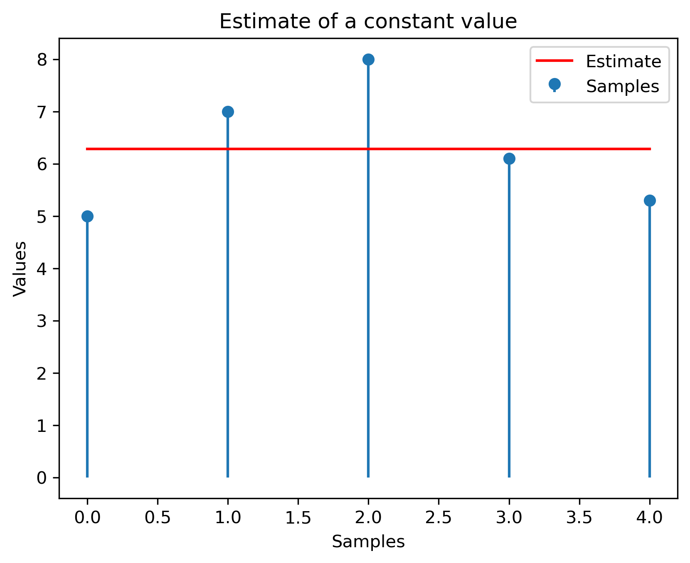
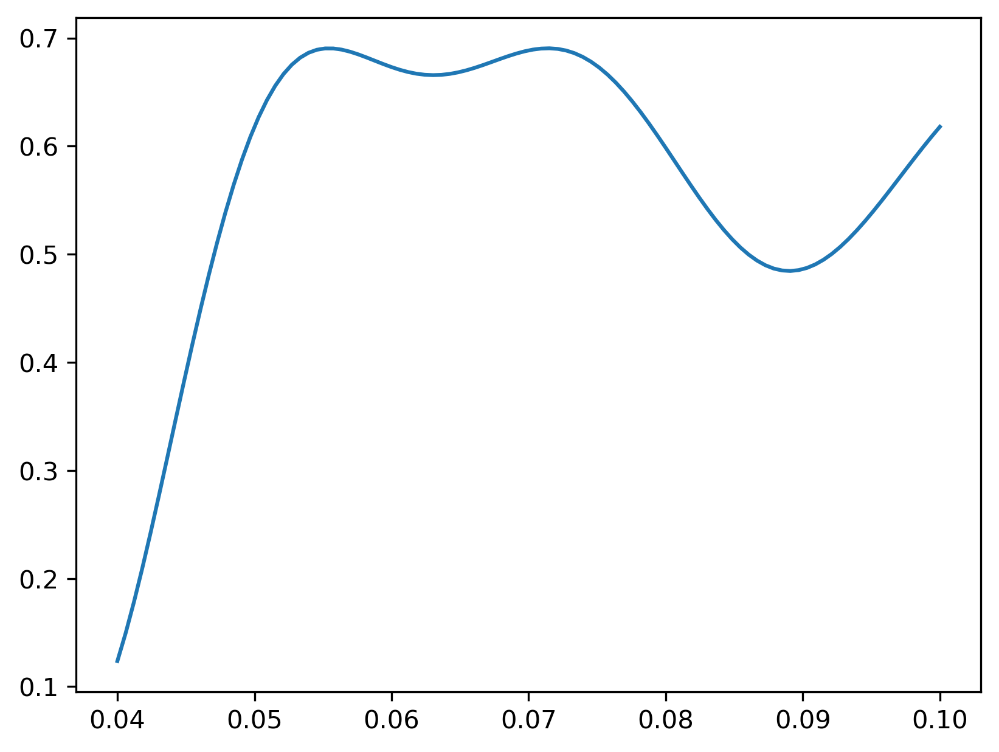
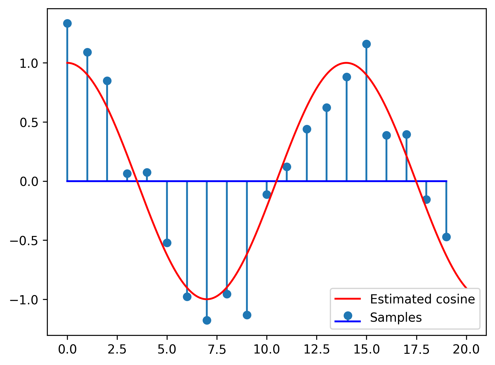

# Chapter III. Elements of Estimation Theory

## III.1 Introduction

### What means "Estimation"?

- A sender transmits a signal $s_\Theta(t)$ which depends on an **unknown** parameter $\Theta$

- The signal is affected by noise, we receive $r(t) = s_\Theta(t) + noise$ 

- We want to **find out** the correct value of the parameter
    - based on samples from the received signal, or the full continuous signal
    - available data is noisy => we "estimate" the parameter

- The found value is $\hat{\Theta}$, **the estimate** of $\Theta$ ("estimatul", rom)
    - there will always be some estimation error $\epsilon = \hat{\Theta} - \Theta$
    

### What means "Estimation"?

- Examples:

    - Unknown amplitude of constant signal: $r(t) = A + noise$, estimate $A$
    - Unknown phase of sine signal: $r(t) = \cos(2 \pi f t + \phi)$, estimate $\phi$
	- Even complicated problems:
	
	    - Record speech signal, estimate/decide what word is pronounced
	
		
### Estimation vs Decision

- Consider the following estimation problem:

	We receive a signal $r(t) = A + noise$, estimate $A$

- For detection, we have to choose between **two known values** of $A$:
    
    - i.e. $A$ can be 0 or 5 (hypotheses $H_0$ and $H_1$)
    
- For estimation, $A$ can be anything => we choose between **infinite number of options** for $A$:
    
    - $A$ might be any value in $\mathbb{R}$, in general

### Estimation vs Decision

- Detection = Estimation constrained to **only a few** discrete options

- Estimation = Detection with an **infinite number** of options available

- The statistical methods used are quite similar

    - In practice, distinction between Estimation and Detections is somewhat blurred
    - (e.g. when choosing between 1000 hypotheses, do we call it "Detection" or "Estimation"?)

### Available data

- The available data is the received signal $r(t) = s_\Theta(t) + noise$

    - it is affected by noise
    - it depends on the unknown parameter $\Theta$
    
- We consider **N samples** from $r(t)$, taken at some sample times $t_i$
	$$\vec{r} = [r_1, r_2, ... r_N]$$

- The samples depend on the value of $\Theta$

### Available data

- Each sample $r_i$ is a random variable that depends on $\Theta$ (and the noise)

    - Each sample has a distribution that depends on $\Theta$
	$$w_i(r_i; \Theta)$$

- The whole sample vector $\vec{r}$ is a N-dimensional random variable
that depends on $\Theta$ (and the noise)

    - It has a N-dimensional distribution that depends on $\Theta$
	$$w(\vec{r}; \Theta)$$

	- Equal to the product of all $w_i(r_i | \Theta)$
	$$w(\vec{r} | \Theta) = w_1(r_1 | \Theta) \cdot w_2(r_2 | \Theta) \cdot ... \cdot w_N(r_N | \Theta)$$

  
### Two types of estimation

- We consider two types of estimation:
    
	1. **Maximum Likelihood Estimation (MLE)**: Besides $\vec{r}$, nothing else is known about the parameter 
	$\Theta$, except maybe some allowed range (e.g. $\Theta > 0$)
	

	2. **Bayesian Estimation**: Besides $\vec{r}$, we know a **prior** distribution $p(\Theta)$ for $\Theta$, 
	which tells us the values of $\Theta$ that are more likely than others
	 
		- this is more general than BE
       

## II.2 Maximum Likelihood estimation

### Maximum Likelihood definition

- When no distribution is known except $\vec{r}$, we use a method
known as **Maximum Likelihood estimation (MLE)**

- We define the **likelihood** of a parameter value $\Theta$, given
the available observations $\vec{r}$ as:
	$$L(\Theta | \vec{r}) = w(\Theta | \vec{r})$$

- $L(\Theta | \vec{r})$ is the likelihood function

- Compare with formula in Chapter 2, slide 20

  - it is the same
  - here we try to "guess" $\Theta$, there we "guessed" $H_i$


### Maximum Likelihood definition

Maximum Likelihood (ML) Estimation: 

- The estimate $\hat{\Theta}_{ML}$ is **the value
that maximizes the likelihood, given the observed data**

   - i.e. the value that maximizes $L(\Theta | \vec{r})$, i.e. maximize $w(\vec{r} | \Theta)$
    $$\hat{\Theta}_{ML} = \arg\max_{\Theta } L(\Theta | \vec{r}) = \arg\max_{\Theta} w(\vec{r} | \Theta)$$

- If $\Theta$ is allowed to live only in a certain range, restrict
the maximization only to that range.

### Notations

- General mathematical notations:

	- $\arg\max_{x} f(x)$ = "the value $x$ which maximizes the function f(x)"
	
	- $\max_{x} f(x)$ = "the maximum value of the function f(x)"

### Maximum Likelihood estimation vs decision

- Very similar with decision problem!

- ML decision criterion:

	- "pick the hypothesis with a higher likelihood":

		$$\frac{L(H_1 | r)}{L(H_0 | r)} = \frac{w(r|H_1)}{w(r|H_0)} \grtlessH 1$$

- ML estimation
  
    - "pick the value which maximizes the likelihood"
    
		$$\hat{\Theta}_{ML} = \arg\max_{\Theta } L(\Theta | \vec{r}) = \arg\max_{\Theta} w(\vec{r} | \Theta)$$


### How to solve

- How to solve the maximization problem?
   
   - i.e. how to find the estimate $\hat{\Theta}_{ML}$ which maximizes $L(\Theta | \vec{r})$

- Find maximum by setting derivative to 0
	$$\frac{d L(\Theta | \vec{r})}{d\Theta} = 0$$

- We can also maximize the **natural logarithm** of the likelihood function ("log-likelihood function")
	$$\frac{d \ln\left(L(\Theta)\right)}{d\Theta} = 0$$

### Solving procedure

Solving procedure:

1. Find the function $$L(\Theta | \vec{r}) = w(\vec{r} | \Theta)$$

1. Set the condition that derivative of $L(\Theta | \vec{r})$ or $\ln(\left(L(\Theta | \vec{r})\right)$ is 0
	$$\frac{d L(\Theta | \vec{r})}{d\Theta} = 0, \text{ or }\frac{d \ln\left(L(\Theta)\right)}{d\Theta} = 0$$

1. Solve and find the value $\hat{\Theta}_{ML}$

1. Check that second derivative at point $\hat{\Theta}_{ML}$ is negative, to check that point is a maximum

   - because derivative = 0 for both maximum and minimum points
   - we'll sometimes skip this, for brevity

### Examples:

- Estimating a constant signal in gaussian noise:

	Find the ML estimate of a constant value $s_\Theta(t) = A$ from 5 noisy measurements
	$r_i = A + noise$ with values $[5, 7, 8, 6.1, 5.3]$. The noise is AWGN $\mathcal{N}(\mu=0, \sigma^2)$.

- Solution: at whiteboard.

- The estimate $\hat{A}_{ML}$ is the average value of the samples

	- not surprisingly, what other value would have been more likely?
	- that's literally what "expected value" means

### Numerical simulation

```{.python .cb.run session=plot}
import matplotlib.pyplot as plt, numpy as np, math;
mu = 0;
sigma = 1;
r = np.array([5, 7, 8, 6.1, 5.3])
plt.stem(r, basefmt=" ", use_line_collection=True)
plt.plot(np.mean(r) * np.ones(r.shape), color = 'red')
plt.xlabel('Samples');
plt.ylabel('Values');
plt.title('Estimate of a constant value');
plt.legend(('Estimate', 'Samples'))
plt.savefig('fig/03_NumericalSim_Constant.png', transparent=True, bbox_inches='tight', dpi=300)
plt.close()
```
{width=70% max-width=1000px}

### Curve fitting

- **Estimation = curve fitting**

    - we're finding the best fitting of $s_\Theta(t)$ through the data $\vec{r}$

- From the previous graphical example:

   - we have some data $\vec{r}$ = some points
   
   - we know the shape of the signal = a line (constant A)
   
   - we're fitting the best line through the data

### General signal in AWGN

- Consider that the true underlying signal is $s_\Theta(t)$
- Consider **AWGN noise** $\mathcal{N}(\mu=0, \sigma^2)$.

- The samples $r_i$ are taken at sample moments $t_i$

- The samples $r_i$ have normal distribution with average value $\mu = s_\Theta(t_i)$
and variance $\sigma^2$

- Overall likelihood function = product of likelihoods for each sample $r_i$
	$$\begin{split}
	L(\Theta | \vec{r}) = w(\vec{r} | \Theta) =& \prod_{i=1}^N \frac{1}{\sigma \sqrt{2 \pi}} e^{- \frac{(r_i - s_\Theta(t_i))^2}{2 \sigma^2}} \\
	=&  \left( \frac{1}{\sigma \sqrt{2 \pi}} \right)^N e^{- \frac{\sum(r_i - s_\Theta(t_i))^2}{2 \sigma^2}}
	\end{split}$$

### General signal in AWGN

- The log-likelihood is 
	$$\begin{split}
	\ln\left(L(\Theta | \vec{r})\right) =& \underbrace{\ln\left(\frac{1}{\sigma \sqrt{2 \pi}}\right)}_{constant} - \frac{\sum(r_i - s_\Theta(t_i))^2}{2 \sigma^2}
	\end{split}$$

### General signal in AWGN

- The maximum of the function = the minimum of the exponent
	$$\hat{\Theta}_{ML} = \arg\max_{\Theta} L(\Theta | \vec{r}) = \arg\min \sum(r_i - s_\Theta(t_i))^2$$

- The term $\sum(r_i - s_\Theta(t_i))^2$ is the **squared distance $d(\vec{r},s_\Theta)$**
	$$d(\vec{r},s_\Theta) = \sqrt{\sum (r_i - s_\Theta(t_i))^2}$$
	$$\left(d(\vec{r},s_\Theta)\right)^2 = \sum (r_i - s_\Theta(t_i))^2$$

### General signal in AWGN

- ML estimation can be rewritten as:
	$$\hat{\Theta}_{ML} = \arg\max_{\Theta} L(\Theta | \vec{r}) = \arg\min_\Theta d(\vec{r}, \vec{s}_\Theta)^2$$

- ML estimate $\hat{\Theta}_{ML}$ = the value that makes $s_\Theta(t_i)$ 
**closest to the received values $\vec{r}$**
 
   - closer = beter fit = more likely
   - closest = best fit = most likely = maximum likelihood

### General signal in AWGN

- ML estimation in AWGN noise = **minimization of distance**

- Hey, we had the same interpretation with ML decision!
  
	- but for decision, we choose the minimum out of 2 options 
	- here, we choose the minimum out of all possible options

- Same interpretation applies for all kinds of vector spaces
 
   - vectors with N elements, continous signals, etc
   - just change the definition of the distance function

### General signal in AWGN

Procedure for ML estimation in AWGN noise:

1. Write the expression for the (squared) distance:
	$$D = \left(d(\vec{r},s_\Theta)\right)^2 = \sum (r_i - s_\Theta(t_i))^2$$

1. We want it minimal, so set derivative to 0:
	$$\frac{d D}{d\Theta} = \sum 2 (r_i - s_\Theta(t_i)) (- \frac{d s_\Theta(t_i)}{d\Theta}) = 0$$

1. Solve and find the value $\hat{\Theta}_{ML}$

1. Check that second derivative at point $\hat{\Theta}_{ML}$ is positive,
 to check that point is a minimum

   - we'll sometimes skip this, for brevity


### Numerical simulation

Estimating the frequency $f$ of a cosine signal

- Find the Maximum Likelihood estimate of the frequency $f$ 
of a cosine signal $s_\Theta(t) = cos(2\pi f t_i)$, 
from 10 noisy measurements 
$r_i = cos(2\pi f t_i) + noise$ with values $[...]$. The noise is AWGN $\mathcal{N}(\mu=0, \sigma^2)$.
The sample times $t_i = [0,1,2,3,4,5,6,7,8,9]$

- Solution: at whiteboard.

### Numerical simulation

The likelihood function is:

```{.python .cb.run session=plot}
import matplotlib.pyplot as plt, numpy as np, math;
np.random.seed(102)
mu = 0;
sigma = 0.2;
ftrue = 0.07;
n = np.arange(0,20)
r = np.cos(2 * math.pi * ftrue * n) + sigma*np.random.randn(20)

# Log-likelihood function 
fvalues = np.linspace(0.04, 0.1, 100);
L = np.zeros((1,500))
L = [np.log(1./(sigma*math.sqrt(2*math.pi))) - (sum(r - np.cos(2 * math.pi * fvalue * n))**2)/2*sigma*sigma for fvalue in fvalues]
fhat = np.amax(L)
plt.plot(fvalues,L)
plt.savefig('fig/03_NumericalSim_CosineFreq_LogLik.png', transparent=True, bbox_inches='tight', dpi=300)
plt.close()
```
{width=70% max-width=1000px}


### Numerical simulation

```{.python .cb.run session=plot}
import matplotlib.pyplot as plt, numpy as np, math;
np.random.seed(102)
mu = 0;
sigma = 0.2;
ftrue = 0.07;
n = np.arange(0,20)
r = np.cos(2 * math.pi * ftrue * n) + sigma*np.random.randn(20)

# Log-likelihood function 
fvalues = np.linspace(0.04, 1/10, 100);
L = np.zeros((1,500))
L = [np.log(1./(sigma*math.sqrt(2*math.pi))) - (sum(r - np.cos(2 * math.pi * fvalue * n))**2)/2*sigma*sigma for fvalue in fvalues]
imax = np.argmax(L)
fhat = fvalues[imax]
plt.stem(n,r, basefmt="b", use_line_collection=True)
ntoplot = np.linspace(0,20,200)
plt.plot(ntoplot, np.cos(2 * math.pi * fhat * ntoplot), color='red')
plt.legend(('Estimated cosine','Samples'))
plt.savefig('fig/03_NumericalSim_CosineFreq.png', transparent=True, bbox_inches='tight', dpi=300)
plt.close()
```
{width=70% max-width=1000px}


### Multiple parameters

- What if we have more than one parameter?

   - e.g. unknown parameters are the amplitude, frequency and the initial phase of a cosine:
	$$s_\vec{\Theta}(t) = A \cos(2 \pi f t + \phi)$$

- We can consider the parameter $\Theta$ to be a vector:

	$$\bm{\Theta} = [\Theta_1, \Theta_2, ... \Theta_M]$$
   
   - e.g. $\bm{\Theta} = [\Theta_1, \Theta_2, \Theta_3] =[A, f, \phi]$

### Multiple parameters

- We solve with the same procedure, but instead of one derivative, 
we have $M$ derivatives

- We solve the system:
	$$\begin{cases} 
	\frac{\partial L}{\partial \Theta_1} = 0 \\ 
	\frac{\partial L}{\partial \Theta_2} = 0 \\ 
	\dots \\
	\frac{\partial L}{\partial \Theta_M} = 0 \\ 
	\end{cases}$$

	- sometimes difficult to solve

### Gradient Descent 

- How to estimate the parameters $\bm{\Theta}$ in complicated cases?
   - e.g. in real life applications
   - usually there are many parameters ($\bm{\Theta}$ is a vector)

- Typically it is impossible to get the optimal values directly by solving the system

- Improve them iteratively with **Gradient Descent** algorithm or its variations

### Gradient Descent procedure

1. Start with some random parameter values $\bm{\Theta}^{(0)}$

2. Repeat for each iteration $k$:

    1. Compute function $L(\bm{\Theta}^{(k)} | \vec{r})$
    
    2. Compute derivatives $\frac{\partial L}{\partial \Theta_i^{(k)}}$ for each $\Theta_i$ (**"gradient"**)
    
    3. Update all values $\Theta_i$ by subtracting the derivative ("**descent**")
        $$\Theta_i^{(k+1)} = \Theta_i^{(k)} - \mu \frac{\partial L}{\partial \Theta_i^{(k)}}$$
       - or, in vector form:
        $$\bm{\Theta}^{(k+1)} = \bm{\Theta}^{k} - \mu \frac{\partial L}{\partial \bm{\Theta}^{(k)}}$$ 

3. Until termination criterion (e.g. parameters don't change much)


### Gradient Descent explained

- Explanations at blackboard

- Simple example: logistic regression on 2D-data
   - maybe do example at blackboard

### Neural Networks

- The most prominent example is **Artificial Neural Networks** (a.k.a. Neural Networks, 
Deep Learning, etc.)

   - Can be regarded as ML estimation 
   - Use Gradient Descent to update parameters
   - State-of-the-art applications: image classification/recognition, automated driving etc.
 
- More info on neural networks / machine learning: 
   
   - look up online courses, books
   - join the IASI AI Meetup

    
### Estimator bias and variance

- How good is an estimator?
    
- An estimator $\hat{\Theta}$ is a **random variable**

   - can have different values, because it is computed based on the received samples, which depend on noise
   - example: in lab, try on multiple computers => slightly different results

- As a random variable, it has:

   - an average value (expected value): $E \left\{ \hat{\Theta} \right\}$
   - a variance: $E \left\{ (\hat{\Theta} - \Theta)^2 \right\}$
    
### Estimator bias and variance

{width=65%}
    
### Estimator bias

- The **bias** of an estimator $\hat{\Theta}$ = difference between the estimator's average value and the true value
    $$Bias = E \left\{ \hat{\Theta} \right\} - \Theta$$

- Estimator is **unbiased** = the average value of the estimator is the true value of $\Theta$
    $$E \left\{ \hat{\Theta} \right\} = \Theta$$
      
- Estimator is **biased** = the average value of the estimator is different from the true value $\Theta$
   - the difference $E \left\{ \hat{\Theta} \right\} - \Theta$ is **the bias** of the estimator


### Estimator bias

- Example: for constant signal A with AWGN noise (zero-mean), ML estimator is $\hat{A}_{ML} = \frac{1}{N}\sum_i r_i$

- Then:
$$\begin{split}
E \left\{ \hat{A}_{ML} \right\} =& \frac{1}{N}E \left\{ \sum_i r_i \right\} \\
=& \frac{1}{N} \sum_{i=1}^N E \left\{ r_i \right\} \\
=& \frac{1}{N} \sum_{i=1}^N E \left\{ A + noise \right\} \\
=& \frac{1}{N} \sum_{i=1}^N A \\
=& A
\end{split}$$

- This estimator in unbiased

### Estimator variance

- The **variance** of an estimator measures the "spread" of the estimator around its average
   
   - that's the definition of variance

- Unbiased estimators are good, but if the **variance** of the estimator is large, then
estimated values can be far from the true value

- We prefer estimators with **small variance**, even if maybe slightly biased


## II.3 Bayesian estimation


### Bayes rule

- In general, we can use the Bayes rule

$$L(\Theta) = w(\Theta | \vec{r}) = \frac{w(\vec{r} | \Theta) \cdot w(\Theta)}{w(\vec{r})}$$

- Explanation of the terms:
  - $\Theta$ is the unknown parameter
  - $\vec{r}$ are the observations that we have
  - $L(\Theta) = w(\Theta | \vec{r})$ is the likelihood of $\Theta$, given our current observations;
  - $w(\vec{r} | \Theta)$ is the "normal" probability of $\vec{r}$ for a given $\Theta$, given by the noise distribution
  - $w(\Theta)$ is the **prior** distribution of $\Theta$, i.e. what we know about $\Theta$ even in the absence of evidence
  - $w(\vec{r})$ is the prior distribution of $\vec{r}$, it is assumed constant


### Bayes rule

- The previous relation is rather complex

\smallskip

- It shows that our estimation of $\Theta$ depends on two things:

  1. The observations that we have, via the term $w(\vec{r} | \Theta)$
  2. The prior knowledge (or prior belief) about $\Theta$, via the term $w(\Theta)$
  
\smallskip
  
(the third term $w(\vec{r})$ is considered a constant, and plays no significant role)


### Bayesian estimation

Bayesian estimation brings two new things to ML estimation:

  1. Take into account a known prior distribution of $\Theta$, $w(\Theta)$
  
  2. Pick a value for the estimate $\hat{\Theta}$ depending on a certain cost function


### Prior distribution

- Suppose we know beforehand a distribution of $\Theta$, $w(\Theta)$
   - we know beforehand how likely it is to have a certain value
   - known as *a priori* distribution or *prior* distribution

- The estimation must take it into account
   - the estimate will be slightly "moved" towards more likely values
    
- Known as "Bayesian estimation"
   - Thomas Bayes = discovered the Bayes rule
   - Stuff related to Bayes rule are often named "Bayesian"

### Cost function

- The **estimation error** is the difference between the estimate $\hat{\Theta}$
and the true value $\Theta$
$$\epsilon = \hat{\Theta} - \Theta$$

- The **cost function $C(\epsilon)$** assigns a cost to each possible estimation error
   - when $\epsilon = 0$, the cost $C(0) = 0$ 
   - small errors $\epsilon$ have small costs
   - large errors $\epsilon$ have large costs

- Usual types of cost functions:
   - Quadratic: $C(\epsilon) = \epsilon^2 = \left( \hat{\Theta} - \Theta \right)^2$
   - Uniform ("hit or miss"): 
    $C(\epsilon) = \begin{cases}
    0, \text{ if } |\epsilon| = |\hat{\Theta} - \Theta | \leq E \\
    1, \text{ if } |\epsilon| = |\hat{\Theta} - \Theta | > E \\
    \end{cases}$
   - Linear: $C(\epsilon) = |\epsilon| = | \hat{\Theta} - \Theta |$
   - draw them at whiteboard

### The Bayesian risk

- The posterior distribution $w(\Theta | \vec{r})$ tells us how likely it is to have a certain value of $\Theta$
  
  - it is a distribution

- Picking a certain estimate value $\hat{\Theta}$ implies a certain error

- The error implies a certain cost

- Multiplying with $C(\epsilon$) and intergrating gives us the expected (average) cost:

$$C = \int_{-\infty}^\infty C(\epsilon) w(\Theta | \vec{r}) d\Theta$$

### The Bayes estimator

- **Bayesian estimation** =  Pick $\hat{\Theta}$ which minimizes the expected cost 

$$\hat{\Theta} = \arg\min_\Theta \int_{-\infty}^\infty C(\epsilon) w(\Theta | \vec{r}) d\Theta$$

- To find it, replace $C(\epsilon)$ with its definition and derivate over $\hat{\Theta}$
   - Attention: derivate with respect to $\hat{\Theta}$, not $\Theta$!

### MMSE estimator

- When the cost function is quadratic $C(\epsilon) = \epsilon^2 = \left( \hat{\Theta} - \Theta \right)^2$
$$C = \int_{-\infty}^\infty (\hat{\Theta} - \Theta)^2 w(\Theta | \vec{r}) d\Theta$$

- We want the $\hat{\Theta}$ that minimizes $C$, so we derivate
$$\frac{dC}{d\hat{\Theta}} = 2 \int_{-\infty}^\infty (\hat{\Theta} - \Theta) w(\Theta | \vec{r}) d\Theta = 0$$

- Equivalent to
$$\hat{\Theta} \underbrace{\int_{-\infty}^\infty w(\Theta | \vec{r})}_1 d\Theta = \int_{-\infty}^\infty \Theta w(\Theta | \vec{r}) d\Theta$$

- The **Minimum Mean Squared Error (MMSE)** estimator is
$$\hat{\Theta} = \int_{-\infty}^\infty \Theta \cdot w(\Theta | \vec{r}) d\Theta$$

### Interpretation

- $w(\Theta | \vec{r})$ is the **posterior** ( or **a posteriori**) distribution 
   - it is the distribution of $\Theta$ after we know the data we received
   - the prior distribution $w(\Theta)$ is the one before knowing any data
    
\smallskip
    
- The MMSE estimation is the **average value** of the posterior distribution

### The MAP estimator

- When the cost function is uniform $C(\epsilon) = \begin{cases}
    0, \text{ if } |\epsilon| = |\hat{\Theta} - \Theta | \leq E \\
    1, \text{ if } |\epsilon| = |\hat{\Theta} - \Theta | > E \\
    \end{cases}$


- Keep in mind that $\Theta = \hat{\Theta} - \epsilon$

- We obtain
$$\begin{split}
I =& \int_{-\infty}^{\hat{\Theta}-E} w(\Theta | \vec{r}) d\Theta + \int_{\hat{Theta} + E}^\infty w(\Theta | \vec{r}) d\Theta \\
I =& 1 - \int_{\hat{\Theta}-E}^{\hat{\Theta}+E} w(\Theta | \vec{r}) d\Theta
\end{split}$$

### The MAP estimator

- To minimize $C$, we must maximize $\int_{\hat{\Theta}-E}^{\hat{\Theta}+E} w(\Theta | \vec{r}) d\Theta$, the integral
around point $\hat{\Theta}$

- For $E$ a very small, the function $w(\Theta | \vec{r})$ is approximately constant, so we pick the point where the function is maximum

- The **Maximum A Posteriori (MAP)** estimator is
$$\hat{\Theta} = \arg\max w(\Theta | \vec{r})$$

- $\arg\max$ = "the value which maximizes the function"
   - $\max f(x)$ = the maximum value of a function
   - $\arg\max f(x)$ = the $x$ for which the function reaches its maximum

### Interpretation

- The MAP estimator chooses $\Theta$ as the value where the posterior distribution is maximum

- The MMSE estimator chooses $\Theta$ as average value of the posterior distribution

{#id .class width=60%}

- [image from https://allenlu2007.wordpress.com]*


### Finding the posterior distribution

- That's cool, but how do we find this posterior distribution $w(\Theta | \vec{r})$?

- Use the Bayes rule
$$w(\Theta | \vec{r}) = \frac{w(\vec{r}; \Theta)}{w(\vec{r})} = \frac{w(\vec{r} | \Theta) \cdot w(\Theta)}{w(\vec{r})}$$

- Since $w(\vec{r})$ is constant for a given $\vec{r}$ the MAP estimator is
$$\hat{\Theta} = \arg\max w(\Theta | \vec{r}) = \arg\max w(\vec{r} | \Theta) w(\Theta)$$

- The MAP estimator is the one which **maximizes** the likelihood of the observed data, 
**but multiplying with the prior distribution $w(\Theta)$**

- The MMSE estimator is the **average** of the same thing


### Relation with Maximum Likelihood Estimator

- The ML estimator was just $\arg\max w(\vec{r} | \Theta)$

- The MAP estimator = like the ML estimator but multiplied with the prior distribution $w(\Theta)$

- If $w(\Theta)$ is a constant, the MAP estimator reduces to ML
   - $w(\Theta)$ = constant means all values $\Theta$ are equally likely
   - i.e. we don't have a clue where the real $\Theta$ might be

- The MMSE estimator = like MAP, but don't take the *argmax* of the function, but its average value

### Relation with Detection

- The minimum probability of error criterion $\frac{w(r | H_1)}{w(r | H_0)} \grtlessH \frac{P(H_0)}{P(H_1)}$

- It can be rewritten as $w(r | H_1)\cdot P(H_1) \grtlessH w(r | H_0) P(H_0)$
   - i.e. choose the hypothesis where $w(r | H)\cdot P(H)$ is maximum
   - $w(r | H_1)$, $w(r | H_0)$ are the likelihood of observed data
   - $P(H_1)$, $P(H_0)$ are the prior probabilities (known beforehand)

- The MAP estimator is where $w(\vec{r} | \Theta) w(\Theta)$ is maximum
   - $w(\vec{r} | \Theta)$ is the likelihood of observed data
   - $w(\Theta)$ is the prior distribution (known beforehand)

- Therefore it is the same principle, merely in a different context:
   - in Detection we are restricted to a few predefined options
   - in Estimation we are unrestricted => choose the maximizing value of the whole function


### 2018-2019 Exam

- Chapter ends here for 2018-2019 exam. Following slides not needed.

### Exercise

Exercise: constant value, 3 measurement, Gaussian same $\sigma$

- We want to estimate today's temperature in Sahara
- Our thermometer reads 40 degrees, but the value was affected by Gaussian noise $\mathcal{N}(0, \sigma^2=2)$ (crappy thermometer)
- We know that this time of the year, the temperature is around 35 degrees, with a Gaussian distribution $\mathcal{N}(35, \sigma^2 = 2)$.
- Estimate the true temperature using ML, MAP and MMSE estimators


### Exercise

Exercise: constant value, 3 measurements, Gaussian same $\sigma$

- What if he have three thermometers, showing 40, 38, 41 degrees

Exercise: constant value, 3 measurements, Gaussian different $\sigma$

- What if the temperature this time of the year has Gaussian distribution $\mathcal{N}(35, \sigma_2^2 = 3)$
   - different variance, $\sigma_2 \neq \sigma$

### General signal in AWGN

- Consider that the true underlying signal is $s_\Theta(t)$
- Consider AWGN noise $\mathcal{N}(\mu=0, \sigma^2)$.

- As in Maximum Likelihood function, overall likelihood function
$$\begin{split}
w(\vec{r} | \Theta) =&  \frac{1}{\sigma \sqrt{2 \pi}} e^{- \frac{\sum(r_i - s_\Theta(t_i))^2}{2 \sigma^2}}
\end{split}$$

- But now this function is also **multiplied with $w(\Theta)$**
$$w(\vec{r} | \Theta) \cdot w(\Theta)$$

### General signal in AWGN

- MAP estimator is the argument that maximizes this product
$$\hat{\Theta}_{MAP} = \arg\max w(\vec{r} | \Theta) w(\Theta)$$

- Taking logarithm
$$\begin{split}
\hat{\Theta}_{MAP} =& \arg\max \ln \left( w(\vec{r} | \Theta) \right) + \ln \left( w(\Theta) \right) \\
=& \arg\max - \frac{\sum(r_i - s_\Theta(t_i))^2}{2 \sigma^2} + \ln \left(w(\Theta)\right)
\end{split}$$

### Gaussian prior

- If the prior distribution is also Gaussian $\mathcal{N}(\mu_\Theta, \sigma_\Theta^2)$
$$ \ln \left(w(\Theta)\right) = - \frac{\sum(\Theta - \mu_\Theta)^2}{2 \sigma_\Theta^2}$$

- MAP estimation becomes
$$ \hat{\Theta}_{MAP} = \arg\min \frac{\sum(r_i - s_\Theta(t_i))^2}{2 \sigma^2} + \frac{\sum(\Theta - \mu_\Theta)^2}{2 \sigma_\Theta^2}$$

- Can be rewritten as
$$ \hat{\Theta}_{MAP} = \arg\min d(\vec{r},s_\Theta)^2 + \underbrace{\frac{\sigma^2}{\sigma_\Theta^2}}_\lambda \cdot d(\Theta, \mu_\Theta)^2$$

### Interpretation

- MAP estimator with Gaussian noise and Gaussian prior
$$\hat{\Theta}_{MAP} = \arg\min d(\vec{r},s_\Theta)^2 + \underbrace{\frac{\sigma^2}{\sigma_\Theta^2}}_\lambda \cdot d(\Theta, \mu_\Theta)^2$$

- $\hat{\Theta}_{MAP}$ is close to its expected value $\mu_\Theta$ and it makes the true signal close to received data $\vec{r}$
   - Example: "search for a house that is close to job and close to the Mall"
   - $\lambda$ controls the relative importance of the two terms
    
- Particular cases
   - $\sigma_\Theta$ very small = the prior is very specific (narrow) = $\lambda$ large = second term very important = $\hat{\Theta}_{MAP}$ close to $\mu_\Theta$
   - $\sigma_\Theta$ very large = the prior is very unspecific = $\lambda$ small = first term very important = $\hat{\Theta}_{MAP}$ close to ML estimation

### Applications

- In general, practical applications:
   - can use various prior distributions
   - estimate **multiple parameters** ( a vector of parameters)

- Applications
   - denoising of signals
   - signal restoration
   - signal compression
