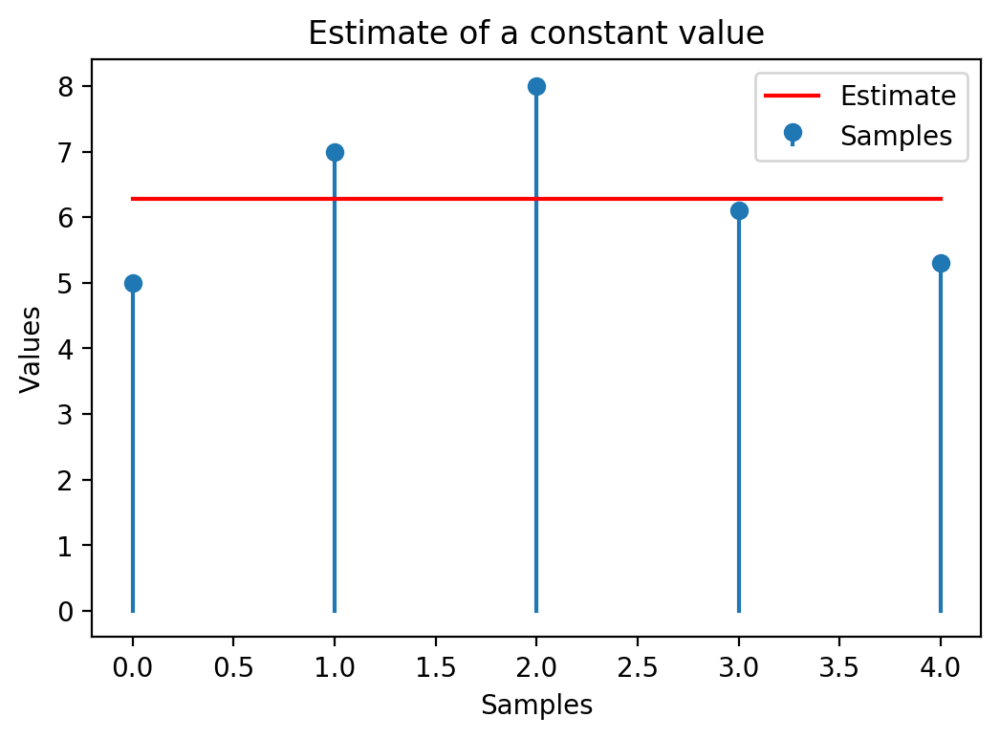
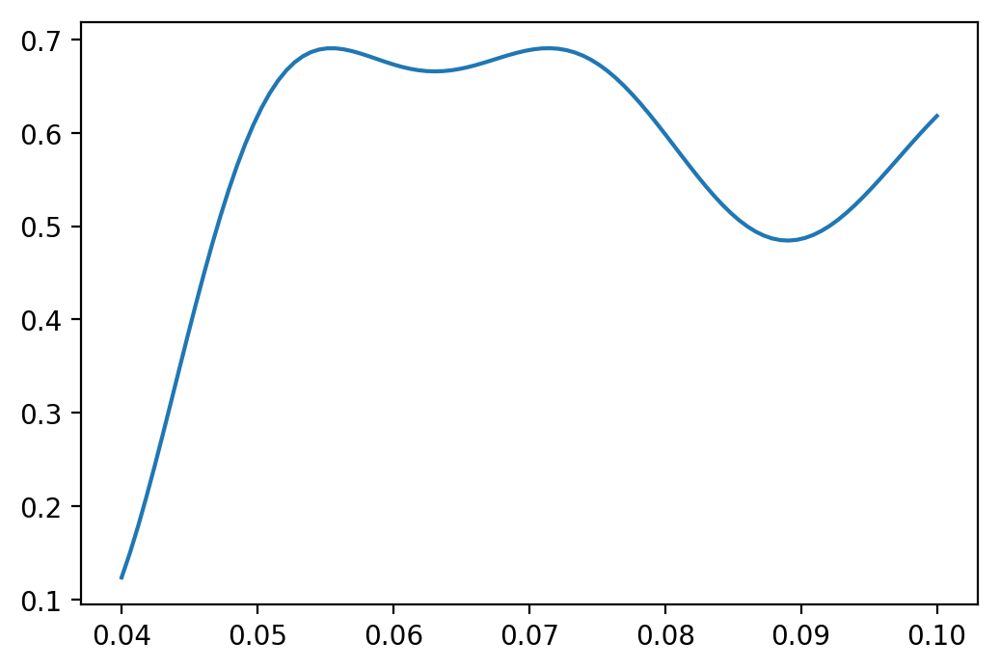
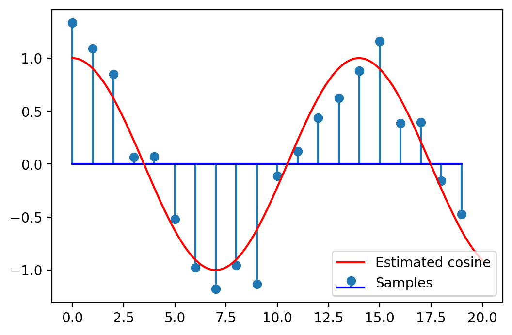

# Chapter III. Elements of Estimation Theory

## II.1 Introduction

### What means "Estimation"?

* A sender transmits a signal $s_\Theta(t)$ which depends on an **unknown** parameter $\Theta$

* The signal is affected by noise, we receive $r(t) = s_\Theta(t) + noise$ 

* We want to **find out** the correct value of the parameter
    * based on samples from the received signal, or the full continuous signal
    * available data is noisy => we "estimate" the parameter

* The found value is $\hat{\Theta}$, **the estimate** of $\Theta$ ("estimatul", rom)
    * there will always be some estimation error $\epsilon = \hat{\Theta} - \Theta$
    
* Examples:
    * Unknown amplitude of constant signal: $r(t) = A + noise$, estimate $A$
    * Unknown phase of sine signal: $r(t) = \cos(2 \pi f t + \phi)$, estimate $\phi$
	* Record speech signal, estimate/decide what word is pronounced
	
### Estimation vs Decision

* Consider the following estimation: $r(t) = A + noise$, estimate $A$

* For detection, we have to choose between **two known values** of $A$:
    * i.e. $A$ can be 0 or 5 (hypotheses $H_0$ and $H_1$)
    
* For estimation, $A$ can be anything => we choose between **infinite number of options** for $A$:
    * $A$ might be any value in $\mathbb{R}$, in general

### Estimation vs Decision

* Detection = Estimation constrained to only a few discrete options

* Estimation = Detection with an infinite number of options available

* The statistical methods used are quite similar
    * In practice, distinction between Estimation and Detections is somewhat blurred
    * (e.g. when choosing between 1000 hypotheses, do we call it "Detection" or "Estimation"?)

### Available data

* The available data is the received signal $r(t)$
    * affected by noise, and depending on the unknown $\Theta$
    
* We consider **N samples** from $r(t)$, taken at some sample times $t_i$
$$\vec{r} = [r_1, r_2, ... r_N]$$

* Each sample $r_i$ is a random variable that depends on $\Theta$ (and the noise)
    * Each sample has a distribution that depends on $\Theta$
$$w_i(r_i; \Theta)$$

* The whole sample vector $\vec{r}$ is a N-dimensional random variable
that depends on $\Theta$ (and the noise)
    * It has a N-dimensional distribution that depends on $\Theta$
$$w(\vec{r}; \Theta)$$

### Types of estimation

* We consider estimating a parameter $\Theta$ under two circumstances:
    
1. No distribution is known about the parameter, except maybe some allowed range (e.g. $\Theta > 0$)
    * The parameter can be any value in the allowed range, equally likely

2. We know a distribution $p(\Theta)$ for $\Theta$, which tells us
the values of $\Theta$ that are more likely than others
    * this is known as *a priori* (or *prior*) distribution (i.e. "known beforehand")
    

## II.2 Maximum Likelihood estimation

### Maximum Likelihood definition

* When no distribution is known about the parameter, we use a method
known as Maximum Likelihood Estimation (MLE)

* The distribution of the received data, $w(\vec{r}; \Theta)$, is known as the **likelihood function**
    * we know the vector $\vec{r}$ we received, so this is a constant
    * the unknown variable in this function is $\Theta$ 
    $$L(\Theta) = w(\vec{r}; \Theta)$$

* Maximum Likelihood Estimation: The estimate $\hat{\Theta}$ is **the value
that maximizes the likelihood of the observed data**
    * i.e. the value $\Theta$ that maximizes $w(r; \Theta)$
    $$\hat{\Theta} = \arg\max_{\Theta} L(\Theta) = \arg\max_{\Theta} w(r; \Theta)$$

* If $\Theta$ is allowed to live only in a certain range, restrict
the maximization only to that range.

### Computations

* Find maximum by setting derivative to 0
$$\frac{d L(\Theta)}{d\Theta} = 0$$

* We can also maximize **natural logarithm** of the likelihood function ("log-likelihood function")
$$\frac{d \ln\left(L(\Theta)\right)}{d\Theta} = 0$$

### Computations

Method:

1. Find the function $$L(\Theta) = w(\vec{r}; \Theta)$$

1. Set the condition that derivative of $L(\Theta)$ or $\ln(\left(L(\Theta)\right)$ is 0
$$\frac{d L(\Theta)}{d\Theta} = 0, \text{ or }\frac{d \ln\left(L(\Theta)\right)}{d\Theta} = 0$$

1. Solve and find the value $\hat{\Theta}$

1. Check that second derivative at point $\hat{\Theta}$ is negative, to check that point is a maximum
    * because derivative = 0 for both maximum and minimum points

### Examples:

Estimating a constant signal in gaussian noise:

* Find the Maximum Likelihood estimate of a constant value $A$ from 5 noisy measurements
$r_i = A + noise$ with values $[5, 7, 8, 6.1, 5.3]$. The noise is AWGN $\mathcal{N}(\mu=0, \sigma^2)$.

* Solution: at whiteboard.

* The estimate $\hat{A}$ is the average value of the samples (not surprisingly)

### Numerical simulation


{width=8cm}\


### General signal in AWGN

* Consider that the true underlying signal is $s_\Theta(t)$
* Consider AWGN noise $\mathcal{N}(\mu=0, \sigma^2)$.

* The samples $r_i$ are taken at sample moments $t_i$

* The samples $r_i$ have normal distribution with average $s_\Theta(t_i)$
and variance $\sigma^2$

* Overall likelihood function = product of likelihoods for each sample $r_i$
$$\begin{split}
L(\Theta) =& \prod_{i=1}^N \frac{1}{\sigma \sqrt{2 \pi}} e^{- \frac{(r_i - s_\Theta(t_i))^2}{2 \sigma^2}} \\
=&  \frac{1}{\sigma \sqrt{2 \pi}} e^{- \frac{\sum(r_i - s_\Theta(t_i))^2}{2 \sigma^2}}
\end{split}$$

* The log-likelihood is 
$$\begin{split}
\ln\left(L(\Theta)\right) =& \underbrace{\ln\left(\frac{1}{\sigma \sqrt{2 \pi}}\right)}_{constant} - \frac{\sum(r_i - s_\Theta(t_i))^2}{2 \sigma^2}
\end{split}$$

### General signal in AWGN

* The maximum of the function = the minimum of the exponent
$$\hat{\Theta} = \arg\max_{\Theta} w(r; \Theta) = \arg\min \sum(r_i - s_\Theta(t_i))^2$$

* The term $\sum(r_i - s_\Theta(t_i))^2$ is the **squared distance $d(\vec{r},s_\Theta)$**
$$d(\vec{r},s_\Theta) = \sqrt{\sum (r_i - s_\Theta(t_i))^2}$$
$$\left(d(\vec{r},s_\Theta)\right)^2 = \sum (r_i - s_\Theta(t_i))^2$$

* Maximum Likelihood estimate $\hat{\Theta}$ = the value that makes $s_\Theta(t_i)$ 
**closest to the received values $\vec{r}$**
    * closer = more likely
    * closest = most likely = maximum likelihood

* For continuous signals? Same, but use distance function for continuous signals

### General signal in AWGN

* Find maximum by setting derivative to 0
$$\begin{split}
\frac{d \ln\left(L(\Theta)\right)}{d\Theta} = 0
\end{split}$$
means
$$\begin{split}
\sum(r_i - s_\Theta(t_i)) \frac{d s_\Theta(t_i)}{d\Theta} = 0
\end{split}$$

### Numerical simulation

Estimating the frequency $f$ of a cosine signal

* Find the Maximum Likelihood estimate of the frequency $f$ of a cosine signal, from 10 noisy measurements
$r_i = cos(2\pi f t_i) + noise$ with values $[...]$. The noise is AWGN $\mathcal{N}(\mu=0, \sigma^2)$.
The sample times $t_i = [0,1,2,3,4,5,6,7,8,9]$

* Solution: at whiteboard.

### Numerical simulation

The likelihood function is:


{width=8cm}\


### Numerical simulation


```
True frequency = 0.070000, Estimate = 0.071515
```

{width=8cm}\


### ML Estimation and ML Detection

* In ML Estimation, the estimate $\hat{\Theta}$ is the value that maximizes
the likelihood function

* In ML Detection, the decision criterion $\frac{w(r | H_1)}{w(r | H_0)} \grtlessH 1$
means "choose the hypothesis that maximizes the likelihood function".

* Therefore it is the same principle, merely in a different context:
    * in Detection we are restricted to a few predefined options
    * in Estimation we are unrestricted => choose the maximizing value


## II.3 Bayesian estimation

### Prior distribution

* Suppose we know beforehand a distribution of $\Theta$, $w(\Theta)$
    * we know beforehand how likely it is to have a certain value
    * known as *a priori* distribution or *prior* distribution

* The estimation must take it into account
    * the estimate will be slightly "moved" towards more likely values
    
* Known as "Bayesian estimation"
    * Thomas Bayes = discovered the Bayes rule
    * Stuff related to Bayes rule are often named "Bayesian"

### Cost function

* The **estimation error** is the difference between the estimate $\hat{\Theta}$
and the true value $\Theta$
$$\epsilon = \hat{\Theta} = \Theta$$

* The **cost function $C(\epsilon)$** assigns a cost to each possible estimation error
    * when $\epsilon = 0$, the cost $C(0) = 0$ 
    * small errors $\epsilon$ have small costs
    * large errors $\epsilon$ have large costs

* Usual types of cost functions:
    * Quadratic: $C(\epsilon) = \epsilon^2 = \left( \hat{\Theta} - \Theta \right)^2$
    * Uniform ("hit or miss"): 
    $C(\epsilon) = \begin{cases}
    0, \text{ if } |\epsilon| = |\hat{\Theta} - \Theta | \leq E \\
    1, \text{ if } |\epsilon| = |\hat{\Theta} - \Theta | > E \\
    \end{cases}$
    * Linear: $C(\epsilon) = |\epsilon| = | \hat{\Theta} - \Theta |$
    * draw them at whiteboard

### The Bayesian risk

* For each pair of values $\vec{r}$ and $\Theta$, $w(\vec{r}; \Theta)$ tells us how likely it is
to have them

* Multiplying with $C(\epsilon$ gives us the cost, for each $\vec{r}$ and $\Theta$
$$C(\epsilon) w(\vec{r}; \Theta)$$

* Integrating over $\Theta$ gives the cost for a certain $\vec{r}$
$$\int_{-\infty}^\infty C(\epsilon) w(\vec{r}; \Theta) d\Theta$$

* Further integrating also over $\vec{r}$ gives the global cost for all $\vec{r}$ and all $\Theta$
$$R = \int_{-\infty}^\infty \int_{-\infty}^\infty C(\epsilon) w(\vec{r}; \Theta) d\Theta d\vec{r}$$

### Minimizing the risk

* We want to minimize the risk R

* Bayes rule: $w(\vec{r}; \Theta) = w(\Theta | \vec{r}) w(\vec{r})$

* Replacing in R, we obtain
$$\begin{split}
R =& \int_{-\infty}^\infty \int_{-\infty}^\infty C(\epsilon) w(\Theta | \vec{r}) w(\vec{r}) d\Theta d\vec{r} \\
=& \int_{-\infty}^\infty w(\vec{r}) \left[ \int_{-\infty}^\infty C(\epsilon) w(\Theta | \vec{r}) d\Theta \right] d\vec{r}
\end{split}$$

* Since $w(\vec{r}) \geq 0$, minimizing the inner integral will minimize $R$
$$I = \int_{-\infty}^\infty C(\epsilon) w(\Theta | \vec{r}) d\Theta$$

* Next, we'll replace $C(\epsilon)$ with its definition and derivate over $\hat{\Theta}$
    * Attention: $\hat{\Theta}$, not $\Theta$!

### MMSE estimator

* When the cost function is quadratic $C(\epsilon) = \epsilon^2 = \left( \hat{\Theta} - \Theta \right)^2$
$$I = \int_{-\infty}^\infty (\hat{\Theta} - \Theta)^2 w(\Theta | \vec{r}) d\Theta$$

* We want the $\hat{\Theta}$ that minimizes $I$, so we derivate
$$\frac{dI}{d\hat{\Theta}} = 2 \int_{-\infty}^\infty (\hat{\Theta} - \Theta) w(\Theta | \vec{r}) d\Theta = 0$$

* Equivalent to
$$\hat{\Theta} \underbrace{\int_{-\infty}^\infty w(\Theta | \vec{r})}_1 d\Theta = \int_{-\infty}^\infty \Theta w(\Theta | \vec{r}) d\Theta$$

* The **Minimum Mean Squared Error (MMSE)** estimator is
$$\hat{\Theta} = \int_{-\infty}^\infty \Theta \cdot w(\Theta | \vec{r}) d\Theta$$

### Interpretation

* $w(\Theta | \vec{r})$ is the **posterior** ( or **a posteriori**) distribution 
    * it is the distribution of $\Theta$ after we know the data we received
    * the prior distribution $w(\Theta)$ is the one before knowing any data
    
* The MMSE estimation is the **average value** of the posterior distribution

### The MAP estimator

* When the cost function is uniform $C(\epsilon) = \begin{cases}
    0, \text{ if } |\epsilon| = |\hat{\Theta} - \Theta | \leq E \\
    1, \text{ if } |\epsilon| = |\hat{\Theta} - \Theta | > E \\
    \end{cases}$
$$\begin{split}

* Keep in mind that $\Theta = \hat{\Theta} - \epsilon$

* We obtain
$$\begin{split}
I =& \int_{-\infty}^{\hat{\Theta}-E} w(\Theta | \vec{r}) d\Theta + \int_{\hat{Theta} + E}^\infty w(\Theta | \vec{r}) d\Theta \\
I =& 1 - \int_{\hat{\Theta}-E}^{\hat{\Theta}+E} w(\Theta | \vec{r}) d\Theta
\end{split}$$

### The MAP estimator

* To minimize $I$, we must maximize $\int_{\hat{\Theta}-E}^{\hat{\Theta}+E} w(\Theta | \vec{r}) d\Theta$, the integral
around point $\hat{\Theta}$

* For $E$ a very small, the function $w(\Theta | \vec{r})$ is approximately constant, so we pick the point where the function is maximum

* The **Maximum A Posteriori (MAP)** estimator is
$$\hat{\Theta} = \arg\max w(\Theta | \vec{r})$$

* $\arg\max$ = "the value which maximizes the function"
    * $\max f(x)$ = the maximum value of a function
    * $\arg\max f(x)$ = the $x$ for which the function reaches its maximum

### Interpretation

* The MAP estimator chooses $\Theta$ as the value where the posterior distribution is maximum

* The MMSE estimator chooses $\Theta$ as average value of the posterior distribution

{#id .class width=60%}

*[image from https://allenlu2007.wordpress.com]*


### Finding the posterior distribution

* That's cool, but how do we find this posterior distribution $w(\Theta | \vec{r})$?

* Use the Bayes rule
$$w(\Theta | \vec{r}) = \frac{w(\vec{r}; \Theta)}{w(\vec{r})} = \frac{w(\vec{r} | \Theta) \cdot w(\Theta)}{w(\vec{r})}$$

* Since $w(\vec{r})$ is constant for a given $\vec{r}$ the MAP estimator is
$$\hat{\Theta} = \arg\max w(\Theta | \vec{r}) = \arg\max w(\vec{r} | \Theta) w(\Theta)$$

* The MAP estimator is the one which **maximizes** the likelihood of the observed data, 
**but multiplying with the prior distribution $w(\Theta)$**

* The MMSE estimator is the **average** of the same thing


### Relation with Maximum Likelihood Estimator

* The MLE estimator was just $\arg\max w(\vec{r} | \Theta)$

* The MAP estimator = like the MLE estimator but with the prior distribution $w(\Theta)$

* If $w(\Theta)$ is a constant, the MAP estimator reduces to MLE
    * $w(\Theta)$ = constant means all values $\Theta$ are equally likely
    * i.e. we don't have a clue where the real $\Theta$ might be

### Relation with Detection

* The minimum probability of error criterion $\frac{w(r | H_1)}{w(r | H_0)} \grtlessH \frac{P(H_0)}{P(H_1)}$

* It can be rewritten as $w(r | H_1)\cdot P(H_1) \grtlessH w(r | H_0) P(H_0)$
    * i.e. choose the hypothesis where $w(r | H)\cdot P(H)$ is maximum
    * $w(r | H_1)$, $w(r | H_0)$ are the likelihood of observed data
    * $P(H_1)$, $P(H_0)$ are the prior probabilities (known beforehand)

* The MAP estimator is where $w(\vec{r} | \Theta) w(\Theta)$ is maximum
    * $w(\vec{r} | \Theta)$ is the likelihood of observed data
    * $w(\Theta)$ is the prior distribution (known beforehand)

* Therefore it is the same principle, merely in a different context:
    * in Detection we are restricted to a few predefined options
    * in Estimation we are unrestricted => choose the maximizing value of the whole function

### Exercise

Exercise: constant value, 3 measurement, Gaussian same $\sigma$

* We want to estimate today's temperature in Sahara
* Our thermometer reads 40 degrees, but the value was affected by Gaussian noise $\mathcal{N}(0, \sigma^2=2)$ (crappy thermometer)
* We know that this time of the year, the temperature is around 35 degrees, with a Gaussian distribution $\mathcal{N}(35, \sigma^2 = 2)$.
* Estimate the true temperature using MLE, MAP and MLE estimators


### Exercise

Exercise: constant value, 3 measurements, Gaussian same $\sigma$

* What if he have three thermometers, showing 40, 38, 41 degrees

Exercise: constant value, 3 measurements, Gaussian different $\sigma$

* What if the temperature this time of the year has Gaussian distribution $\mathcal{N}(35, \sigma_2^2 = 3)$
    * different variance, $\sigma_2 \neq \sigma$

### General signal in AWGN

* Consider that the true underlying signal is $s_\Theta(t)$
* Consider AWGN noise $\mathcal{N}(\mu=0, \sigma^2)$.

* As in Maximum Likelihood function, overall likelihood function
$$\begin{split}
w(\vec{r} | \Theta) =&  \frac{1}{\sigma \sqrt{2 \pi}} e^{- \frac{\sum(r_i - s_\Theta(t_i))^2}{2 \sigma^2}}
\end{split}$$

* But now this function is also **multiplied with $w(\Theta)$**
$$w(\vec{r} | \Theta) \cdot w(\Theta)$$

### General signal in AWGN

* MAP estimator is the argument that maximizes this product
$$\hat{\Theta}_{MAP} = \arg\max w(\vec{r} | \Theta) w(\Theta)$$

* Taking logarithm
$$\begin{split}
\hat{\Theta}_{MAP} =& \arg\max \ln \left( w(\vec{r} | \Theta) \right) + \ln \left( w(\Theta) \right) \\
=& \arg\max - \frac{\sum(r_i - s_\Theta(t_i))^2}{2 \sigma^2} + \ln \left(w(\Theta)\right)
\end{split}$$

### Gaussian prior

* If the prior distribution is also Gaussian $\mathcal{N}(\mu_\Theta, \sigma_\Theta^2)$
$$ \ln \left(w(\Theta)\right) = - \frac{\sum(\Theta - \mu_\Theta)^2}{2 \sigma_\Theta^2}$$

* MAP estimation becomes
$$ \hat{\Theta}_{MAP} = \arg\min \frac{\sum(r_i - s_\Theta(t_i))^2}{2 \sigma^2} + \frac{\sum(\Theta - \mu_\Theta)^2}{2 \sigma_\Theta^2}$$

* Can be rewritten as
$$ \hat{\Theta}_{MAP} = \arg\min d(\vec{r},s_\Theta)^2 + \underbrace{\frac{\sigma^2}{\sigma_\Theta^2}}_\lambda \cdot d(\Theta, \mu_\Theta)^2$$

### Interpretation

* MAP estimator with Gaussian noise and Gaussian prior
$$\hat{\Theta}_{MAP} = \arg\min d(\vec{r},s_\Theta)^2 + \underbrace{\frac{\sigma^2}{\sigma_\Theta^2}}_\lambda \cdot d(\Theta, \mu_\Theta)^2$$

* $\hat{\Theta}_{MAP}$ is close to its expected value $\mu_\Theta$ and it makes the true signal close to received data $\vec{r}$
    * Example: "search for a house that is close to job and close to the Mall"
    * $\lambda$ controls the relative importance of the two terms
    
* Particular cases
    * $\sigma_\Theta$ very small = the prior is very specific (narrow) = $\lambda$ large = second term very important = $\hat{\Theta}_{MAP}$ close to $\mu_\Theta$
    * $\sigma_\Theta$ very large = the prior is very unspecific = $\lambda$ small = first term very important = $\hat{\Theta}_{MAP}$ close to ML estimation

### Applications

* In general, practical applications:
    * can use various prior distributions
    * estimate **multiple parameters** ( a vector of parameters)

* Applications
    * denoising of signals
    * signal restoration
    * signal compression
    
### Estimator bias

* How good is an estimator?
    * Many ways to characterize
    
* An estimator $\hat{\Theta}$ is a **random variable**
    * can have different values, because it is computed based on the received samples, which depend on noise
    * example: in lab, try on multiple computers => slightly different results

* As a random variable, it has:
    * an average value (expected value): $E \left\{ \hat{\Theta} \right\}$
    * a variance: $E \left\{ (\hat{\Theta} - \Theta)^2 \right\}$
    
### Estimator bias

* **Unbiased** estimator = if the average value of the estimator is the true value of $\Theta$
$$E \left\{ \hat{\Theta} \right\} = \Theta$$
      
* **Biased** estimator = if the average value of the estimator is different from the true value $\Theta$
    * the difference $E \left\{ \hat{\Theta} \right\} - \Theta$ is called **the bias** of the estimator


### Estimator bias

* Example: for constant signal A with AWGN noise (zero-mean), ML estimator is $\hat{A}_{ML} = \frac{1}{N}\sum_i r_i$

* Then:
$$\begin{split}
E \left\{ \hat{A}_{ML} \right\} =& \frac{1}{N}E \left\{ \sum_i r_i \right\} \\
=& \frac{1}{N} \sum_{i=1}^N E \left\{ r_i \right\} \\
=& \frac{1}{N} \sum_{i=1}^N E \left\{ A + noise \right\} \\
=& \frac{1}{N} \sum_{i=1}^N A \\
=& A
\end{split}$$

* This estimator in unbiased

### Estimator variance

* Unbiased estimators are good, but if the **variance** of the estimator is large, then
estimated values can be far from the true value

* We prefer estimators with **small variance**, even if maybe slightly biased
