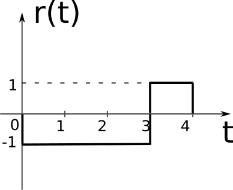

1. Consider detecting a signal $s_1(t) = 3 \sin(2 \pi f_1 t)$ that can be present (hypothesis $H_1$) or not ($s_0(t)=0$, hypothesis $H_0$).
The signal is affected by AWGN $\mathcal{N}(0, \sigma^2=1)$.
The receiver takes 2 samples.

    b. The receiver takes 2 samples with values $\left\{ 1.1, 4.4 \right\}$, at sample times $t_1 = \frac{0.125}{f_1}$ and $t_2 = \frac{0.625}{f_1}$.
    What is decision according to Maximum Likelihood criterion?

	\smallskip

3. A transmitted signal can be one of the following $s_0(t)$ or $s_1(t)$ (depicted below).
The received signal is $r(t)$. 
The signal is affected by AWGN $\mathcal{N}(0, \sigma^2=2)$.
Find the receiverțs decision based on the Maximum Likelihood criterion, in two ways:
    a. based on 3 samples taken at moments $t_1 = 0.5$, $t_2 = 1.5$ and $t_2 = 3.5$
    b. with continuous observation

	\ {.id width=25%} \      {.id width=25%} \      {.id width=25%}  

	\smallskip

4. Consider the k-NN algorithm with the following training set, composed
of 5 vectors of class A and another 5 vectors from class B:
    * Class A:
$$\vec{v}_1 = \begin{bmatrix}2 \\ -4\end{bmatrix}\;
\vec{v}_2 = \begin{bmatrix}1 \\ -5\end{bmatrix}\;
\vec{v}_3 = \begin{bmatrix}-2 \\ 6\end{bmatrix}\;
\vec{v}_4 = \begin{bmatrix}-3 \\ 4\end{bmatrix}\;
\vec{v}_5 = \begin{bmatrix}2 \\ -5\end{bmatrix}$$
    * Class B:
$$\vec{v}_6 = \begin{bmatrix}3 \\ 1\end{bmatrix}\;
\vec{v}_7 = \begin{bmatrix}-1 \\ 1\end{bmatrix}\;
\vec{v}_8 = \begin{bmatrix}-4 \\ -3\end{bmatrix}\;
\vec{v}_9 = \begin{bmatrix}-3 \\ 0\end{bmatrix}\;
\vec{v}_{10} = \begin{bmatrix}-2 \\ 3\end{bmatrix}$$

    Compute the class of the vector $\vec{x} = \begin{bmatrix}-2 \\ 5 \end{bmatrix}$
using the k-NN algorithm, with $k=1$, $k=3$, $k=5$, $k=7$ and $k=9$

4. Consider the following 10 values:
$$\vec{v} = \left\lbrace v_i \right\rbrace = [ 1.1, 0.9, 
5.5, 0.6, 5, 6, 1.3, 4.8, 6, 0.8 ] $$

    Perform 5 iterations of the k-Means algorithm in order to find two centroids $\vec{c}_1$ și $\vec{c}_2$,
starting from two random values $\vec{c}_1 = 0.95$ și $\vec{c}_2 = 0.96$. 

	\smallskip
